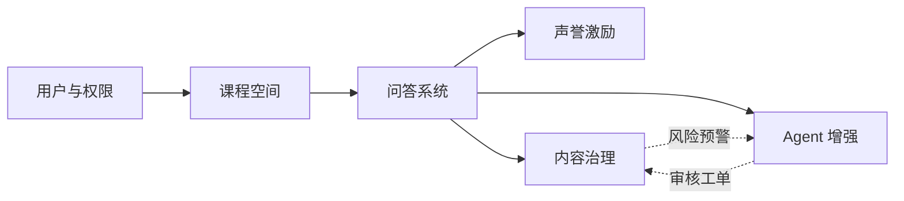
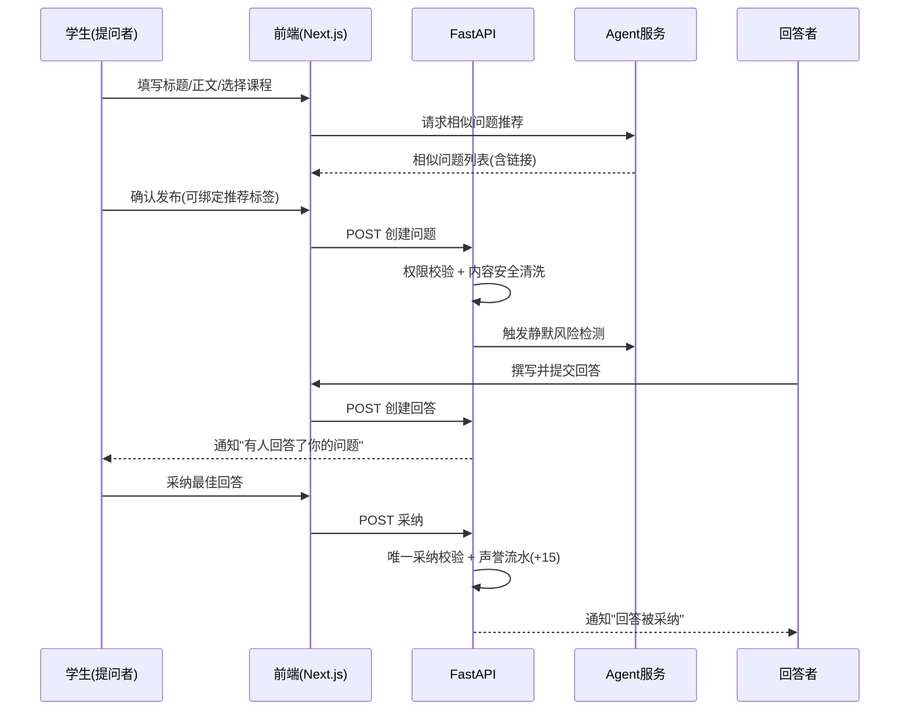
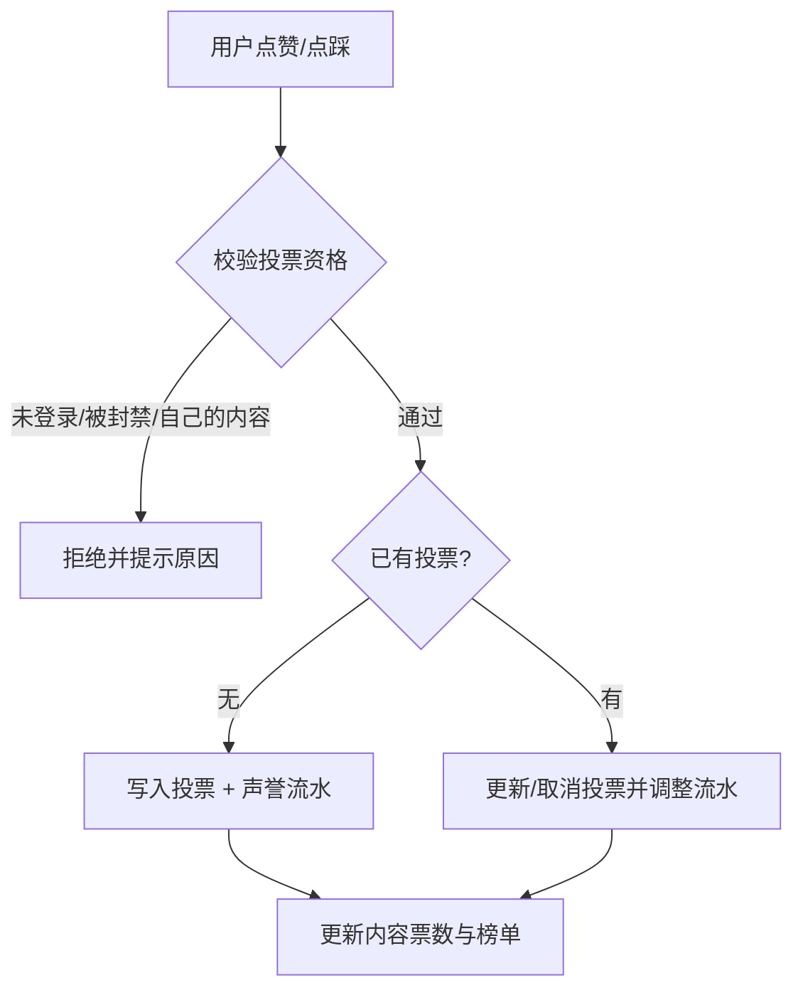
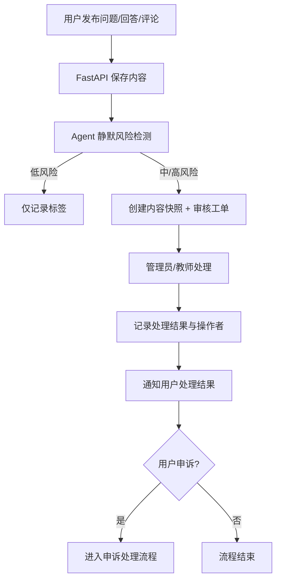
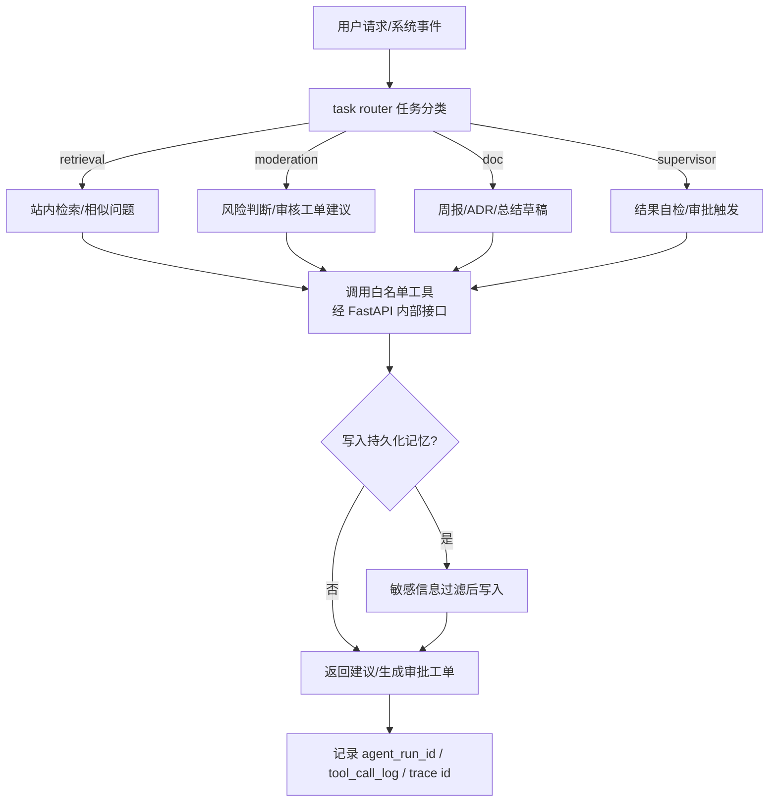

# CampusOverflow AI 业务流程分析

> Issue：#5 analysis engineer（阅读骨架并总结业务流程）
> 依据：`docs/需求文档.md`、`docs/设计文档.md`、`docs/项目骨架分析.md`、根目录《全量业务拆解与增量开发蓝图》
> 定位：蓝图文档偏"产品拆解与增量规划"，本文聚焦**业务流程总结**：角色、业务域、核心流程与业务红线，配套链路图见 [业务链路图.md](./业务链路图.md)。

## 1. 项目概述

CampusOverflow AI 是面向高校课程场景的智能问答平台，定位为"校园问答平台 + 课程知识库 + 声誉社区 + 受控 Agent Loop"。系统由三个物理分离的服务组成：

| 服务 | 职责 |
| ---- | ---- |
| Next.js 前端 | 页面体验、BFF 转发、AI 流式 UI |
| FastAPI 业务后端 | 认证、RBAC、核心 CRUD、事务一致性、审批执行、MySQL 访问 |
| Agent 服务（TypeScript） | 单 Agent Loop、任务路由、工具调用、记忆与观测，不直接连 MySQL |

## 2. 用户角色与诉求

| 角色 | 主要诉求 |
| ---- | -------- |
| 游客 | 浏览公开问题与课程公开内容 |
| 学生 | 提问、回答、搜索、积累声誉 |
| 助教 | 回答问题、标记典型问题、协助审核 |
| 教师 | 管理课程、认证优质回答、查看周报与学习热点 |
| 管理员 | 用户管理、内容审核、封禁与申诉处理、系统配置 |
| AI Agent | 站内检索、标签/相似问题推荐、风险预警、文档草稿、持久化记忆 |

权限设计要点：学生、助教、教师、管理员四类角色权限不可混写；所有写操作必须校验当前用户权限；被封禁用户不能发帖、回答、评论或投票。

## 3. 业务域与核心规则

平台业务划分为六个核心域：

### 3.1 用户与权限域

- 注册、登录、退出、资料维护；密码加密保存。
- 角色决定可见功能；越权操作（如学生执行教师认证）必须被拒绝。
- 管理员可禁用/解禁用户，封禁状态实时生效。

### 3.2 课程空间域

- 课程是问答内容的组织单位，问题必须归属某一课程。
- 教师只能管理自己负责的课程（管理员除外）。
- 课程详情页聚合课程问题、标签、活跃用户和高频问题。

### 3.3 问答系统域（问题 / 回答 / 评论）

- 问题：标题正文必填、Markdown 内容、安全清洗防脚本注入、支持软删除。
- 回答：登录用户可回答；提问者可采纳最佳答案；一个问题最多一个被采纳答案。
- 评论：支持对问题和回答评论、二级回复；删除后普通用户侧不可见。
- 采纳操作与积分变更必须在同一事务中保持一致。

### 3.4 标签域

- 标签分课程标签、技术标签和自定义标签；同一问题不能重复绑定同一标签。
- Agent 可以推荐标签，但**必须经用户确认后**才由 FastAPI 写入标签关系。

### 3.5 声誉激励域

- 用户可对问题/回答点赞点踩，可修改或取消；同一用户对同一内容只保留一个有效投票。
- 积分规则：回答被采纳 +15、被点赞 +10、被点踩 -2。
- 积分变化必须有流水记录，不能只改总分；支持周榜/月榜/课程榜。

### 3.6 内容治理域

- 采用"AI 预警 + 人工确认"机制：Agent 只能建议，处置动作（忽略、要求修改、临时隐藏、软删除、警告、限时封禁、永久封禁）由管理员/教师执行。
- 每次风险判断必须保存内容快照和原因；用户可查看处理通知并提交申诉。

### 3.7 Agent 增强域

- 单 Agent Loop + task router（retrieval / moderation / doc / supervisor 四类任务处理器）。
- Agent 不直接访问 MySQL，只通过 FastAPI `/internal/agent/*` 白名单接口交互。
- 每次运行有 `agent_run_id`，每次工具调用记录 `tool_call_log`，跨服务调用携带 trace id。

## 4. 核心业务流程

### 4.1 学生提问 - 回答 - 采纳闭环

### 4.2 投票与声誉流水

### 4.3 内容治理：AI 预警 + 人工确认

### 4.4 Agent 辅助与任务路由

## 5. 业务红线（不可违反的约束）

1. Agent 不直接连接 MySQL，不绕过 FastAPI 执行业务写入。
2. 高风险动作（删帖、封号、内容隐藏、文件写入、外部 MCP 调用）只能生成待确认工单，由人工执行。
3. AI 推荐的标签/相似问题不自动写入，必须经用户确认。
4. 一个问题最多一个采纳答案；采纳与积分流水保持事务一致。
5. 积分变化必须有流水记录，不能只改总分。
6. 记忆不得包含密码、密钥、隐私原文；写入前后都要做敏感信息过滤。
7. 未注册的 MCP 工具不可调用；MCP 工具不能直接修改核心业务表。
8. 所有 Agent run、tool call、approval request 必须可追踪（trace id + 摘要）。

## 6. 与仓库其他文档的关系

| 文档 | 视角 |
| ---- | ---- |
| 全量业务拆解与增量开发蓝图 | 产品总分层、三端拆解、增量开发规划 |
| docs/需求文档.md | 功能需求与验收标准 |
| docs/analysis/业务流程分析.md（本文） | 业务流程与规则总结，含 mermaid 流程图 |
| docs/analysis/业务链路图.md | 端到端系统链路与数据流向 |
