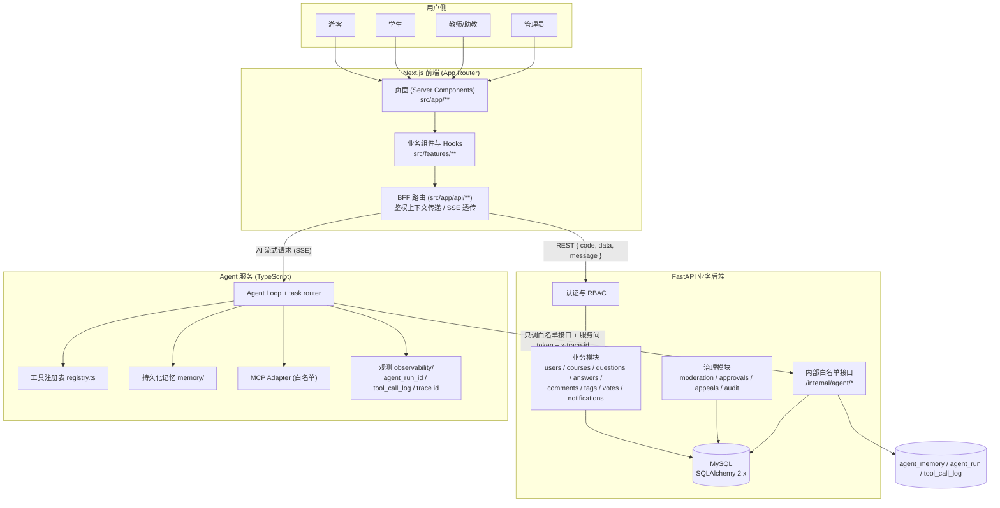
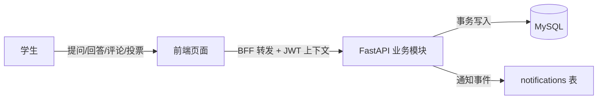
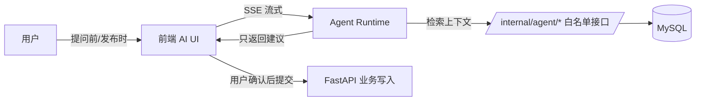
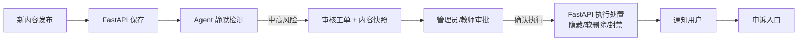
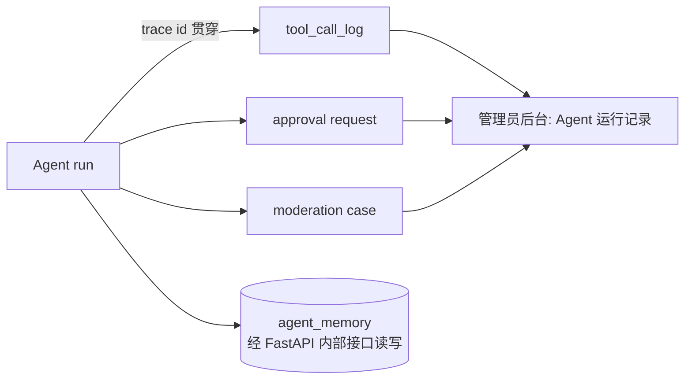

# CampusOverflow AI 业务链路图

> Issue：#5 analysis engineer
> 定位：从系统视角画出"用户请求 → 前端 → 业务后端 → 数据"的端到端链路，以及 Agent 增强链路和治理链路。流程细节见 [业务流程分析.md](./业务流程分析.md)。

## 1. 端到端总体链路

## 2. 分链路说明

### L1 问答主链路

- 前端不直接访问数据库，所有业务请求经 BFF 携带鉴权上下文转发。
- FastAPI 统一返回 `{ code, data, message }`，写操作全部经过 RBAC 校验。

### L2 AI 增强链路

- Agent 只"建议"不"写入"：标签推荐、相似问题、辅助回答均由用户确认后经 FastAPI 正常业务接口落库。
- AI 生成内容必须标识来源，不得冒充教师/助教。

### L3 内容治理链路

- 高风险动作（删帖、封号、隐藏、文件写入、外部 MCP 调用）一律"先工单、后人工、再执行"。
- 快照、操作者、原因、期限全程留痕，支持审计与申诉。

### L4 观测与记忆链路

- 每次运行、工具调用、审批请求都携带 trace id 与摘要，可关联、可回放。
- 记忆读写只经 FastAPI 内部接口，写入前后做敏感信息过滤（不含密码、密钥、隐私原文）。

## 3. 关键边界约定

| 边界 | 约定 |
| ---- | ---- |
| 前端 ↔ 数据库 | 禁止直连，必须经 BFF → FastAPI |
| Agent ↔ MySQL | 禁止直连，只经 `/internal/agent/*` 白名单接口 |
| Agent ↔ 高风险动作 | 只生成审批工单，人工确认后由 FastAPI 执行 |
| MCP 工具 | 必须白名单注册，经 registry / policy / adapter 三层 |
| 跨服务调用 | 必须携带 `x-trace-id`，统一错误码 |
