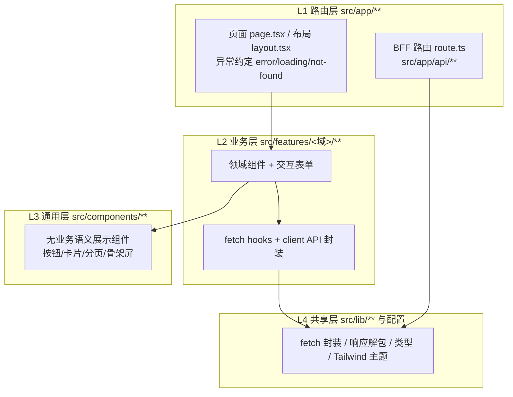
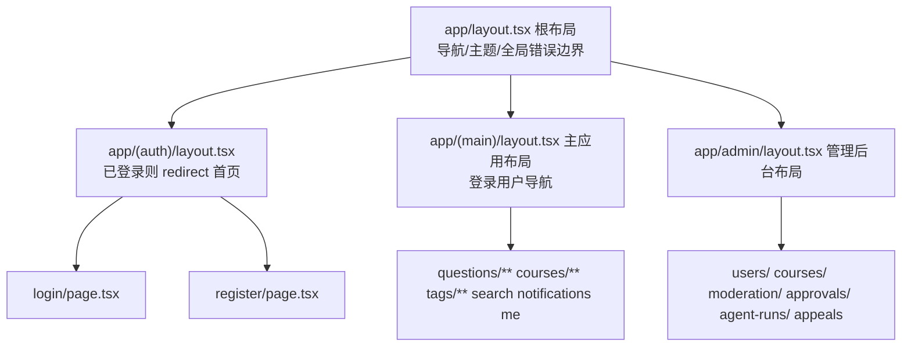
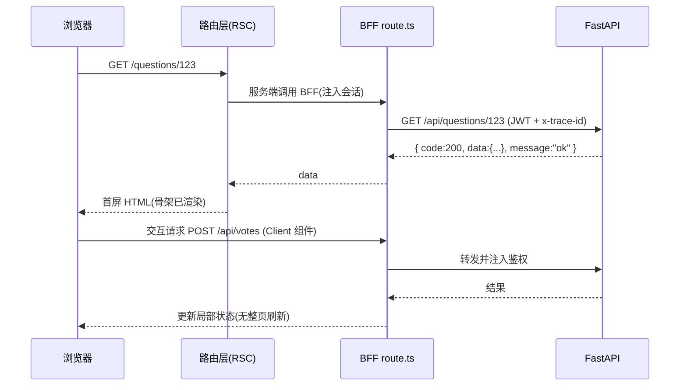

# 前端分层与路由拆解

> 回应评审意见："写的可以详细一点，关于前端的分层拆解特别是路由那一层"。
> 本文与 [docs/前端业务拆分/前端业务拆分.md](../前端业务拆分/前端业务拆分.md) 互补：那份按**业务域**拆模块（M0~M11），本文按**技术层**拆前端，重点展开路由层（Next.js App Router）。

## 1. 前端总体分层

| 层 | 目录 | 职责 | 禁止事项 |
| ---- | ---- | ---- | ---- |
| L1 路由层 | `src/app/**` | URL 到页面的映射、布局嵌套、服务端渲染（RSC）、BFF 转发 | 不写业务规则，只做编排 |
| L2 业务层 | `src/features/<域>/**` | 各业务域的组件、hooks、客户端 API 封装 | 不直接访问 FastAPI 之外的地址 |
| L3 通用层 | `src/components/**` | 与业务无关的可复用 UI | 不含业务文案与请求 |
| L4 共享层 | `src/lib/**` 等 | 统一 fetch 封装、`{ code, data, message }` 解包、错误码映射 | — |

依赖方向严格单向：`app → features → components → lib`，禁止反向引用。

## 2. 路由层详解（重点）

### 2.1 App Router 文件约定

| 文件 | 作用 | 本项目用法 |
| ---- | ---- | ---- |
| `layout.tsx` | 嵌套布局，跨页面持久化 | 根布局放导航与主题；`(auth)`、`admin` 布局内做权限守卫 |
| `page.tsx` | 路由的叶子页面 | 默认 Server Component，服务端取数直接渲染 |
| `loading.tsx` | 段级 Suspense 骨架 | 问题列表/课程页提供骨架屏 |
| `error.tsx` | 段级错误边界（client） | 展示重试按钮，上报错误 |
| `not-found.tsx` | 404 兜底 | 问题/课程不存在时的中文提示 |
| `route.ts` | Route Handler（BFF） | 只做转发/鉴权上下文/SSE 透传 |
| `(group)` | 路由分组，不影响 URL | `(auth)` 放登录注册，`(main)` 放主应用 |
| `[id]` | 动态段 | `/questions/[id]`、`/courses/[id]` |

### 2.2 页面路由表

| 路由 | 页面职责 | 渲染方式 | 访问权限 |
| ---- | ---- | ---- | ---- |
| `/` | 首页：热门问题、课程入口、搜索框 | Server | 公开 |
| `/login` `/register` | 登录/注册 | Client（表单交互） | 公开 |
| `/courses` `/courses/[id]` | 课程列表/课程详情（聚合问题与标签） | Server | 公开/登录 |
| `/questions` | 问题列表：筛选、排序、分页 | Server + Client 筛选条 | 公开 |
| `/questions/new` | 提问表单（含相似问题推荐、标签确认） | Client | 登录，被封禁禁用 |
| `/questions/[id]` | 问题详情：回答区、评论区、投票、采纳 | Server 首屏 + Client 交互块 | 公开读，登录写 |
| `/tags` `/tags/[name]` | 标签广场与标签下的问题 | Server | 公开 |
| `/search?q=` | 搜索结果页 | Server | 公开 |
| `/notifications` | 通知中心 | Server | 登录 |
| `/me` `/me/edit` | 个人主页与资料编辑 | Server + Client | 登录 |
| `/admin/users` | 用户管理（搜索、封禁/解禁） | Server + Client | teacher/admin |
| `/admin/courses` | 课程管理 | Server + Client | teacher/admin |
| `/admin/moderation` | 内容审核队列 | Server + Client | admin/teacher |
| `/admin/approvals` | 审批工单中心（高风险动作确认） | Server + Client | admin |
| `/admin/agent-runs` | Agent 运行记录（run/工具调用/trace） | Server | admin |
| `/admin/appeals` | 封禁申诉处理 | Server + Client | admin |

拆分原则：页面默认 Server Component 负责取数与首屏；只有表单、投票、评论输入、AI 流式面板等**需要浏览器能力或局部状态**的部分下沉为 `"use client"` 子组件（存放在对应 `features/<域>/`），页面文件本身保持精简。

### 2.3 布局嵌套与权限守卫

守卫实现分两级：**布局级**在 `layout.tsx`（Server）读取会话 Cookie，角色不符直接 `redirect("/login")`，保证未授权用户拿不到页面 HTML；**接口级**在 BFF `route.ts` 校验会话并注入 JWT 后才转发到 FastAPI，FastAPI 侧再用 RBAC 复核，两层互为兜底。

### 2.4 BFF 路由层（`src/app/api/**`）

BFF 只做三件事，不写任何业务规则：

1. **转发**：把前端请求转发到 FastAPI 对应的 `/api/auth/*`、`/api/users/*`、`/api/courses/*`、`/api/questions/*`、`/api/answers/*`、`/api/comments/*`、`/api/tags/*`、`/api/votes/*`、`/api/reputation/*`、`/api/search/*`、`/api/notifications/*`、`/api/admin/moderation/*`。
2. **鉴权上下文传递**：从会话取出 token 注入 `Authorization` 头，并透传 `x-trace-id`。
3. **SSE 透传**：AI 流式接口把 Agent 服务的流式响应原样透传给浏览器。

统一约定：BFF 解包 FastAPI 的 `{ code, data, message }`——`code=200` 返回 `data`；`401` 触发跳转登录；`403/404/400` 映射为页面级错误状态。

### 2.5 AI 流式路由

`/api/agent/*`（如标签推荐、相似问题、辅助回答）以 SSE 与 Agent 服务通信，前端用 `@ai-sdk/react` 消费流式输出，组件必须覆盖四种状态：生成中（loading）、失败重试（error/retry）、需要人工确认（approval-needed）、完成。AI 返回的标签与相似问题只作为**建议**渲染，用户确认后才走普通业务接口提交。

## 3. 一次典型访问的完整链路

## 4. 路由层与其他层的协作红线

1. 页面（路由层）不出现 `fetch` 明文 URL，一律调用 `features` 的封装或 BFF。
2. 新增页面必须同步补齐 `loading.tsx`/`error.tsx`/空状态，三者缺一不可。
3. 新增后台页必须挂到 `app/admin/layout.tsx` 守卫之下，禁止绕过布局直开页面。
4. 业务模块拆分对应关系见《前端业务拆分》，新增路由需同步更新该文档的路由清单。
