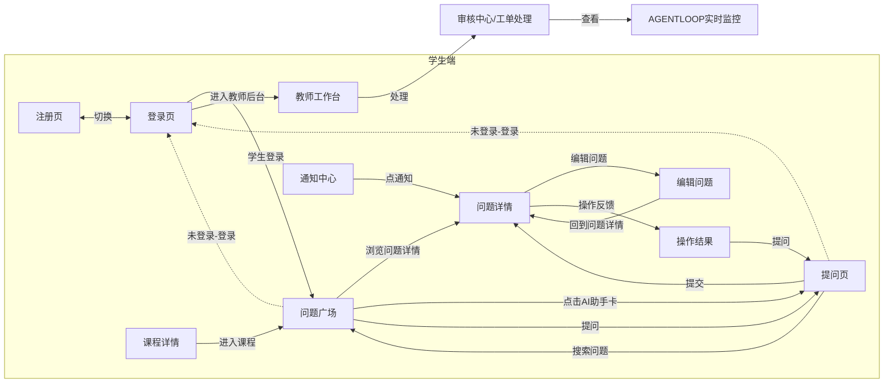

# 页面版式与页面连接说明（手绘版前端页面设计图解读）

> 依据：`docs/前端架构/前端服务需求文档.md` 3.1（三端布局）/ 3.2（页面与跳转级联）/ 3.4（AI 交互）/ 3.6（权限可见性）。
> 对应图：《交付-手绘版-前端页面设计图.png》（本说明按图逐页解读，手写字迹以合理判读为准，不确定处已标注 ⚠️）。

## 1. 全局版式规范（三端统一约定）

| 端 | 布局 | 图上体现 |
| -- | ---- | -------- |
| 学生端 `/` | 顶栏导航 + 内容区 + 右栏 | 每页顶部一排页签（问题广场 / 课程 / 榜单·搜索 ⚠️ / AI ⚠️ / 用户），主体内容居中，右侧辅助栏 |
| 教师端 `/teacher` | 顶栏（教师信息）+ 工作台卡片 | 教师工作台：顶部教师信息条，下方指标卡矩阵 |
| 管理端 `/admin` | 侧栏 + 顶栏 | 审核中心 / 运行监控：左侧列表栏 + 右侧详情区 |

公共版式要点：

1. **顶栏页签常驻**：学生端所有页面共享同一排顶部页签，保证"广场 ⇄ 课程 ⇄ 用户 ⇄ AI"随时互跳。
2. **右栏辅助信息**：问题详情页右栏放"个人主页入口 / AI 辅助回答 / 相关问题"三块。
3. **AI 卡片内嵌**：AI 能力以卡片形式嵌在主体页内（问题广场的"AI 助手卡"、提问页的"AI 辅助区"、问题详情右栏"AI 辅助回答"），不是独立整页（与规格 3.4 一致；图上顶栏出现的"AI"页签见第 5 节差异）。
4. **三态与草稿**：编辑类页面（提问 / 编辑问题）带"编辑 / 预览"切换；编辑问题页标注"自动保存草稿（时间间隔触发）"，对应规格 500 错误保留草稿的要求。

## 2. 学生端页面版式（图上 9 页）

### 2.1 注册页
- 小型表单卡：账号信息字段 + 提交按钮；底部"已有账号？去登录"切换入口。
- spec v3 已移除游客角色；未登录用户可访问登录/注册页，访问业务页面或操作时引导登录。

### 2.2 登录页
- 表单卡 + 登录/注册按钮；登录成功按角色分流：学生 → 问题广场，教师 → **进入教师后台**（图上主标注箭头）。

### 2.3 问题广场（首页）
- 顶栏页签 + 主体内容（问题卡列表 / 筛选 / 榜单入口）+ 右侧 **AI 助手卡**。
- 出口：点问题卡 → 问题详情；点"提问" → 提问页；点 AI 助手卡 → AI 辅助入口；未登录点写操作 → 登录页。

### 2.4 提问页（发布问题）
- 主体：标题/正文编辑区；底部 **提交 / 取消** 两个动作按钮。
- AI 辅助区：相似问题推荐、标签推荐（AI 生成 → 用户勾选确认后才写入，规格 3.4）。
- 出口：提交成功 → 问题详情；取消 → 返回来源页；未登录 → 登录页（图上"未登录-登录"箭头之一）。

### 2.5 课程详情
- 课程信息主体 + **进入课程** 按钮（加入/进入课程问答区）。
- 出口：课程内问题 → 问题详情；"我要提问" → 提问页（可预填课程）。

### 2.6 通知中心
- 通知列表：**被回答、被采纳、审核结果** 等系统通知。
- 出口：点通知 → 通知来源页（问题详情 / 工单 / 申诉结果）；全部已读为页内操作。

### 2.7 编辑问题
- 主体：**编辑 / 预览** 双态切换编辑器。
- 底部标注：**自动保存草稿（按时间间隔触发）**。
- 出口：保存 → **回到问题详情**（图上回环箭头）；取消 → 返回原页。

### 2.8 问题详情
- 主体内容：问题正文 + 操作按钮 **编辑 / 删除**（作者可见）+ 回答区（回答 / 评论 / 投票 / 采纳）。
- 右栏三块：**个人主页入口、AI 辅助回答、相关问题**。
- 出口：编辑 → 编辑问题；点用户 → 用户主页；操作反馈 → 操作结果。

### 2.9 操作结果
- 操作（编辑 / 采纳等）完成后的结果反馈页；提供 **提问** 按钮回到提问流程。
- ⚠️ 该页未出现在规格 3.2 的 P-S01~P-S13 清单中，见第 5 节差异 D1。

## 3. 教师端页面版式（图上 1 页）

### 教师工作台
- 顶部：**教师信息栏**（当前登录教师身份）。
- 主体指标卡矩阵：**我的课程 / 待处理工单 / 待审核问题 / 我的回答**。
- 下方：**动态调课信息**；动作区含 **待处理 / 历史** 视图切换。
- 出口：点"处理" → 工单处理（图上 → 审核中心/工单处理）。

## 4. 管理端页面版式（图上 2 页）

### 4.1 审核中心（工单处理）
- 左栏：**工单列表**；右栏：**工单信息** 详情 + **查看** 按钮。
- 面板内标注：**Agent 运行记录可跳转 Agent 运行详情**（工单 ↔ run 双向追溯）。
- 出口：查看工单详情；跳 Agent 运行监控。

### 4.2 运行时分析 + AGENT LOOP 实时监控
- 顶部页签：**Agent 运行记录 / 执行统计 / 实时面板 / 用户** ⚠️（末项字迹不确定）。
- 主体：**AGENT LOOP 时间轴**（九步时间轴，规格 3.4）。
- 右侧：执行记录展开显示 **基本信息 + Tool Calls**；动作：**停止工具 / 拒绝工具**。
- 出口：关联工单 → 审批中心（规格 P-A08）。

## 5. 页面连接总表（按图上箭头逐一登记）

| # | 起点 | 触发动作 | 终点 | 图上标注 |
| - | ---- | -------- | ---- | -------- |
| 1 | 注册页 | "已有账号？去登录" | 登录页 | 页内切换 |
| 2 | 登录页 | 教师角色登录成功 | 教师工作台 | 进入教师后台 |
| 3 | 登录页 | 学生角色登录成功 | 问题广场 | （默认首屏） |
| 4 | 任意受保护页 | 未登录点写操作 | 登录页 | 未登录-登录（图上两条箭头） |
| 5 | 问题广场 | 点问题卡 | 问题详情 | 浏览问题详情 |
| 6 | 问题广场 | 点击 AI 助手卡 | AI 辅助入口（提问页内 AI 区） | 点击AI助手卡 |
| 7 | 问题广场 / 课程详情 | 点"提问" | 提问页 | 提问 |
| 8 | 提问页 | 提交成功 | 问题详情 | 提交 |
| 9 | 提问页 | 搜索问题 | 搜索结果 / 问题广场 | 搜索问题 |
| 10 | 问题详情 | 点"编辑" | 编辑问题 | 编辑问题 |
| 11 | 编辑问题 | 保存 | 问题详情 | 回到问题详情 |
| 12 | 问题详情 | 编辑/采纳等操作完成 | 操作结果 | 操作反馈 |
| 13 | 操作结果 | 点"提问" | 提问页 | 提问 |
| 14 | 顶栏铃铛 | 点通知 | 通知来源页（问题详情等） | 收到通知 |
| 15 | 课程详情 | 点"进入课程" | 课程问答区 | 进入课程 |
| 16 | 教师工作台 | 点"处理" | 工单处理 | 处理 |
| 17 | 审核中心（工单） | 点"查看" / Agent 运行记录 | 运行监控（Agent 运行详情） | 查看 |

Mermaid 流程概览：

## 6. 图 ↔ 规格差异点（需评审对齐）

> **定案（2026-09-20 评审 + 2026-10-06 用户拍板）**：① **AI 相关页面先不做**——顶栏"AI"页签、AI 助手卡、页内 AI 辅助区、我的 AI 记忆、Agent 运行监控均暂缓实施，页面骨架预留位置，随 Agent 服务接入后补齐；② 其余差异**按"取多的一方"合并**：D1、D3 图上多出的页面补录进清单，D4 规格更全（教师端工单处理 + 管理端审批中心两处都保留，版式复用），D5"执行统计"随 AI 暂缓。控件级落地见《页面控件级设计说明.md》。

| 编号 | 差异 | 图上 | 规格 3.2 | 建议 |
| ---- | ---- | ---- | -------- | ---- |
| D1 | "操作结果"独立页 | 有（P-?） | 无此页，仅有页内反馈 | 二选一：并入全局 toast/结果弹层，或补录页面清单 |
| D2 | 顶栏"AI"独立页签 | 有 | AI 为页内嵌卡片，无独立页 | 若无独立 AI 会话页规划，顶栏改为"AI 助手"悬浮入口 |
| D3 | 顶栏中部页签语义 | "搜索记录"（判读） | 问题广场内搜索 + 排行榜 `/rankings` | 确认是"排行榜"还是独立"搜索记录"页 |
| D4 | 审核中心归属 | 图上画在"管理端"圆圈下 | 工单处理属教师端 `/teacher/moderation`，审批中心属管理端 | 确认图上"审核中心"对应哪端页面；两端均需工单列表+详情版式可复用 |
| D5 | 运行监控页签 | Agent运行记录/执行统计/实时面板/用户 | P-A07 运行记录 + P-A08 运行详情两页 | "执行统计"为新增视图，需补接口或作为运行记录页的页内 Tab |

> 以上差异确认后，应回改 `specs/spec.md` 与《前端服务需求文档》3.2，并重跑一致性分析（`specs/analyze.md`）。
