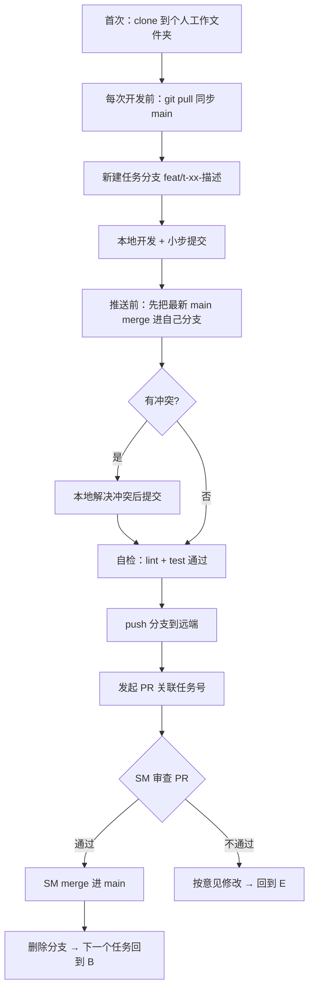
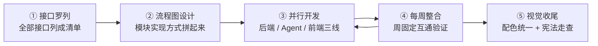
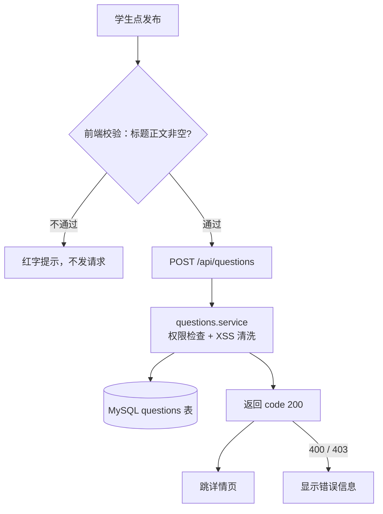

# 开发协作流程文档

> 状态：v1（2026-09-07）
> 适用读者：本项目全体开发成员（前端 / 业务后端 / Agent 服务）与 SM（Scrum Master）
> 上游文档：[workflow.md](./workflow.md)（规格流程）、[操作文档.md](./操作文档.md)（环境与 Agent 协作）、[../AGENTS.md](../AGENTS.md)（硬性约束）
> 一句话原则：**main 分支永远可运行；所有改动走"拉取 → 分支 → 先 merge → 推送 → PR → SM 审查"，没有人直接改 main。**

## 1. 总览



## 2. 首次准备：建个人工作文件夹

每人本机一个独立工作目录，禁止多人共用同一个文件夹（会互相覆盖文件）。

```bash
# 文件夹放哪都行，路径不要含中文和空格更稳妥
D:\work\campus-overflow-ai

# 首次克隆（<仓库地址> 换成团队仓库）
git clone <仓库地址> D:\work\campus-overflow-ai
cd D:\work\campus-overflow-ai
```

克隆后按 [操作文档.md](./操作文档.md) 第 3 节安装三服务依赖（后端 uv、前端与 Agent npm）并配置 `.env`（不提交）。

## 3. 项目级五步流程（整个项目按什么顺序推进）

第 4 节的每日循环是"每一步内部怎么干活"，本节是项目级的推进地图，共五步。需求不单独开会——第一步列接口清单、第二步画模块流程图，图画完需求就罗列清楚了：



### 第一步：罗列全部接口（对照 US，只列清单不写细节）

对照 [spec.md](../specs/spec.md) 的 US-01~19 逐条过：每个 US 需要哪些接口，全部列成一张总表。这一步只列清单不写细节，列全就是目标。宪法 C-01~C-08 是底线。

清单放 `docs/接口文档.md` 顶部：

| 方法 | 路径 | 一句话用途 | 对应 US | 调用方 |
| ---- | ---- | ---------- | ------- | ------ |
| POST | /api/questions | 发布问题 | US-03 | 前端 questions/new |
| GET | /internal/agent/questions/search | 相似问题候选检索 | US-12 | Agent 服务 |

### 第二步：流程图设计 → 接口契约冻结（全员评审）

把每个模块的实现方式用流程图拼起来：从用户操作开始，走哪条接口、后端 service 做什么（校验 / 权限 / 事务 / 清洗）、数据落到哪、返回什么、前端怎么响应。每个模块一张图，示例（发布问题）：



画到哪条接口，就把清单里那条补成完整条目（4 个问题模板见下）。图全部画完后：

1. **发现的接口需求回填规格**：新路径、新字段写入 [plan.md](../specs/plan.md) 第 5 节 + [项目骨架分析](./项目骨架分析.md) 第 9 节——**不是前端私有一份新文档**。
2. **重跑 `/speckit.analyze`**，通过后接口契约冻结。
3. **冻结之后改接口的唯一途径**：回填上面两处 → 重跑 analyze → 三端同步知悉。任何"前端偷偷改调用"都算违约。

**接口条目怎么写（新手版：每条接口回答 4 个问题）**：

```markdown
## POST /api/questions —— 发布问题（US-03 / T-04）

1. 谁调用？登录用户；未登录 → 401
2. 传什么？
   | 字段     | 类型   | 必填 | 说明           |
   | -------- | ------ | ---- | -------------- |
   | title    | string | 是   | 最长 100 字    |
   | body     | string | 是   | Markdown 正文  |
   | courseId | string | 是   | 已加入的课程   |
3. 回什么？{ code: 200, data: { id, title, createdAt }, message: "ok" }
4. 错了怎么办？空标题/超过 100 字 → 400；没加入这个课程 → 403
```

4 个问题都答清楚，这条接口前端后端就都能开工了。三态（loading / 空态 / 报错）、边界情况不用单独写——在第二步的流程图里画出来就行。

统一规则（就 3 条）：

- 返回永远是 `{ code, data, message }` 三层，不要自己发明格式；失败时 code 用 400 / 401 / 403 / 404 / 500 之一
- 字段名小驼峰（如 `createdAt`）；路径用名词（`/api/questions`），不要动词（不要 `/api/addQuestion`）
- 文档示例里不放真实的密码、密钥、Cookie

草稿存放：接口清单与条目都在 `docs/接口文档.md`（清单在顶部，条目按模块一节），模块流程图放 `docs/模块流程图.md`（按模块一节）；评审通过后回填 plan.md 第 5 节 + 骨架分析第 9 节，PR 走 SM 审查。

### 第三步：并行开发（契约冻结后互不阻塞）

三条线同时开工，每条线一人（前端 / 业务后端 / Agent 各一名，从认领的域一直做到底）；每个 T-xx 内部都走第 4 节的分支 / PR / SM 审查流程：

| 线 | 工作项 | 做什么 | 每任务自检 |
| -- | ------ | ------ | ---------- |
| 业务后端 | T-02~T-10 | `app/modules/<域>/` 四件套 models / schemas / service / router；权限与事务放 service 层 | `uv run pytest` + `uv run ruff check .` |
| Agent 服务 | T-11~T-16 | 单 Agent Loop + task router、工具注册 `registry.ts`、`/internal/agent/*` 白名单对接、记忆 / 审批 / 观测 | `npm test` + `npm run lint`（mock 模型，不依赖真实 LLM） |
| 前端 | T-02~T-10 对应页面 | **用 mock 数据先跑通交互与三态**（loading / 空状态 / 错误状态；AI 页面加：生成中 / 失败重试 / 需人工确认） | `npm test` + `npm run lint` |

> 前端"等契约"不等于"等后端写完"——契约冻结 + mock 数据让三条线完全并行，这是前两步要先冻结契约的原因。

### 第四步：每周整合（按周节奏，不是最后才联调）

团队节奏：每人每周约三个有效提交（指 merge 进 main 的任务量；本地小 commit 随时可提，不占这个数）。整合验证按周执行：

- **每周整合（固定，雷打不动）**：周会当天所有人把最新 main 拉到本地，起三服务 → `http://localhost:3000/api/health` 三服务全 up → 把本周完成的 T-xx 主流程串起来冒烟一遍（如：注册 → 提问 → 回答 → 采纳 → 积分变化）。
- **merge 时轻量验证（顺手做，不算联调）**：PR 自检照常；merge 后任务完成者只验证自己任务的接口真实可用（把 mock 换成真接口的对应调用）。
- **汇报**：周整合完成后群里报结果，附截图或短录屏；发现不通的任务当场排查，不拖到下周。
- **联调暴露接口问题**：回到第二步的回填流程（回填 → analyze → 三端同步），禁止单方面改。

> 风险提示：两次周整合之间最多积累一周偏差，所以分支上的代码必须"随时可跑"（本地 lint / test 不欠账），周整合才不会炸。

> 进度衡量：提交数只是节奏参考，真正的进度以 specs/tasks.md 的勾选为准。

### 第五步：视觉收尾（最后才动美术）

- **只动视觉层**：配色、间距、字号、圆角、空态插画；**不动**页面结构、接口调用、状态逻辑——三态和 AI 三种状态在第三步就已内置，不是现在补。
- **走查清单**（对照宪法逐条过）：
  - C-01：界面文案全简体中文；
  - C-04：无蓝紫渐变，整体清爽现代、无"AI 模板感"；
  - Tailwind 统一的配色 / 间距 token，不写行内样式；
  - 抽查 3~5 个核心页的三态 + AI 三态仍完整。
- **产出**：走查单 + 修复 PR，同样走 SM 审查。
- 同时做宪法自检（对应 T-20）：对照 C-01~C-08 全量过一遍，结果记入 specs/analyze.md。

## 4. 每日开发循环（核心，每天照做）

### 4.1 开发前：先 pull

开工第一件事永远是同步远端，避免在旧代码上开发：

```bash
git checkout main
git pull origin main
```

### 4.2 建任务分支

一个任务（specs/tasks.md 的一个 T-xx）一个分支，不混装多个任务：

```bash
# 命名：<type>/t<任务号>-<短描述>，type 用 feat/fix/docs/chore
git checkout -b feat/t02-user-auth
```

### 4.3 本地开发与提交

- 改动范围只限该任务边界（越界改动先在群里说明）。
- 小步提交，格式 `<type>: <简短中文描述>`，如 `feat: 用户注册接口与 JWT 签发`。
- 开发过程中可随时 `git commit`，此时**不用 push**。

### 4.4 推送前：先 merge main（关键步骤）

开发完准备推送时，先把远端最新的 main 合进自己的分支，把冲突消灭在本地：

```bash
git fetch origin
git merge origin/main
```

有冲突时：

```bash
# 1. 打开冲突文件，搜索 <<<<<<< 标记
# 2. 与被改动文件的最近提交者商量保留哪边（不要闷头随便选）
# 3. 解决后：
git add <解决的文件>
git commit
```

> 为什么先 merge：PR 里出现冲突会直接卡住审查；在本地 merge 等于提前替全组做了集成测试，SM 审查时看到的已经是能合并的代码。

### 4.5 自检后推送

```bash
# 自检（改动哪个服务跑哪个；跨服务全跑）
cd campus-overflow-ai/backend  && uv run ruff check . && uv run pytest
cd campus-overflow-ai/frontend && npm run lint && npm test
cd campus-overflow-ai/agent    && npm run lint && npm test

# 通过后推送
git push origin feat/t02-user-auth
```

### 4.6 CI 与 PR 模板

本项目通过 GitHub Actions 对 Pull Request 和 main 分支执行质量检查。

当前 CI 覆盖三部分：

- frontend：安装依赖、执行 ESLint、运行 Vitest
- backend：安装开发依赖、执行 ruff、运行 pytest
- agent：安装依赖、执行 ESLint、运行 Vitest

所有功能改动必须通过 Pull Request 合并。PR 描述应填写关联 Issue、修改说明、测试证据和自检清单。CI 未通过、评审意见未处理或 Reviewer 未批准时，不应合并到 main。

### 4.7 发起 PR

在托管平台（GitHub/Gitee）从 `feat/t02-user-auth` 向 `main` 发起 PR，描述里写清：

```text
任务：T-02 用户注册登录与角色权限（US-02、E-07/E-08）
改动：backend/app/modules/{users,auth}、backend/tests/...；已勾选 specs/tasks.md
自检：pytest 通过、ruff 零 error、越权访问返回 403 已验证
```

## 5. SM 审查 PR

### 5.1 SM 审查清单（逐项过）

| 检查项 | 判定标准 |
| ------ | -------- |
| 任务对应 | PR 关联了 tasks.md 的任务号，改动范围与任务边界一致，无越界文件 |
| 硬性约束 | AGENTS.md 约束 1~8 无违反（重点：Agent 未直连数据库、无密钥入库、界面文案全中文） |
| 测试与 lint | CI 或本地复跑：所属服务 pytest / vitest 通过，ruff / eslint 零 error |
| 规格同步 | 若 PR 改了 spec.md / plan.md / tasks.md，是否重跑了 /speckit.analyze |
| 完成证据 | tasks.md 对应任务已勾选并写结果；核心流程可演示 |

### 5.2 审查结果处理

- **通过**：SM 在平台上 merge 进 main（用 merge 方式，保留分支历史），随后删除该分支。
- **不通过**：PR 里写明"哪一条不达标 + 怎么改"；开发者改完**重新走 4.4（先 merge 最新 main）→ 自检 → push**，PR 会自动更新，不需要重开。
- **审查时效**：SM 每天固定时间（建议下班前）集中审一轮，PR 不隔夜积压。

### 5.3 红线（任何人都不得）

- 禁止直接 push 到 main（main 只通过 PR 进代码）。
- 禁止 force push（尤其对 main 和他人分支）。
- 禁止未经 SM 审查自行 merge。
- 禁止提交 `.env`、密钥、数据库 dump、日志、构建产物。

## 6. 与规格流程的衔接

- 做什么任务：只从 [specs/tasks.md](../specs/tasks.md) 领取，按 Phase 顺序，不跳序。
- 任务完成：勾选 + 写一行结果是收尾动作的一部分，SM 审查会检查。
- 需求变了：先改 spec/plan/tasks → 重跑 `/speckit.analyze` → 再回来写代码。

## 7. 常见问题

**Q：忘 pull 就开始写了怎么办？**
A：立刻补 `git fetch origin && git merge origin/main`，解决冲突后继续；不要等推送时才发现落后一大截。

**Q：两个人改了同一个文件怎么办？**
A：merge 时必然有人遇到冲突，双方当面/群里对齐该段逻辑，由后 merge 的人解决；解决不了拉 SM 定夺。

**Q：PR 提了很久没人审？**
A：群里 @SM；SM 审查是每日固定职责，不是有空才做。

**Q：小改动也要开分支开 PR 吗？**
A：要。改一个错别字也一样走流程，成本很低，跳过流程的风险（main 被破坏）很高。
