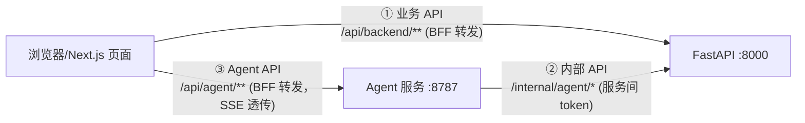

# 接口设计指南

> 状态：v1（2026-09-07）
> 适用读者：三端开发成员（前端 / 业务后端 / Agent），新手向
> 上游文档：[项目骨架分析](./项目骨架分析.md) 第 9 节（路径规划）、[plan.md](../specs/plan.md) 第 5 节（内部 API 草案）、[开发协作流程文档](./开发协作流程文档.md) 第一 / 二步（清单 → 流程图 → 冻结）
> 一句话原则：**先列全清单，再补细节；每条接口必须能回答"谁调用、传什么、回什么、错了怎么办"。**

## 1. 三端接口总览（先分清谁调谁）

本项目共三类接口，调用方向固定，不许交叉直连：



| 类别 | 路径前缀 | 谁写 | 谁调用 | 鉴权方式 |
| ---- | -------- | ---- | ------ | -------- |
| ① 业务 API | `/api/*` | 后端 | 前端（经 BFF） | `Authorization: Bearer <JWT>` |
| ② 内部 API | `/internal/agent/*` | 后端 | **只有 Agent 服务** | `X-Service-Token` + `X-Trace-Id` |
| ③ Agent API | `/agent/*` | Agent 服务 | 前端（经 BFF，SSE 流式） | 透传用户 JWT 或服务 token |

BFF 规则（前端成员记住）：浏览器**永远不直接**访问 8000/8787，只调 Next.js 同源的 `/api/backend/**` 和 `/api/agent/**`，由 `next.config.ts` 的 rewrites 转发——所以本指南列的后端路径如 `/api/questions`，前端实际写 `/api/backend/api/questions`（若 rewrites 未做路径改写，以此为准，联调时对一下即可）。

## 2. 设计总规则（写任何接口前先记住）

1. **响应永远是三层**：`{ code: number, data: T, message: string }`。成功 `code=200`；失败 code 只用 6 个：

   | code | 含义 | 典型场景 |
   | ---- | ---- | -------- |
   | 200 | 成功 | — |
   | 400 | 参数错误 | 空标题、超长、格式不对、**重复邮箱也归这类**（message 写清原因） |
   | 401 | 未登录 / token 失效 | 没带 JWT、token 过期 |
   | 403 | 无权限 | 学生调管理接口、改别人的帖子、未加入课程就提问 |
   | 404 | 不存在 | 问题已删除、课程不存在 |
   | 500 | 服务器错误 | 数据库挂了、未捕获异常 |

2. **路径用名词复数，动作靠 HTTP 方法表达**：`GET /api/questions` 查列表、`POST /api/questions` 新建、`PATCH /api/questions/{id}` 改、`DELETE /api/questions/{id}` 删。不要出现 `/api/addQuestion`、`/api/getList`。
3. **字段一律小驼峰**：`createdAt`、`courseId`、`pageSize`。
4. **列表接口必带分页**：请求 `?page=1&pageSize=20`，响应 data 里带 `total`。需要排序就加 `sort` 参数（如 `sort=latest|hot`），需要筛选就加专用参数（如 `courseId`、`tagId`、`unresolved=true`）。
5. **写操作在 service 层判权限**：router 只收参数；"学生不能删别人的帖"这类规则写在 service，不在 router。
6. **每条接口标注来源**：对应哪个 US、哪个 T-xx，写进文档标题，SM 审查会查。
7. **敏感信息红线**：文档示例和真实响应都不出现密码、密钥、Cookie、隐私原文（宪法 C-07）。

## 3. 业务 API 清单（前端 ↔ 后端，共 12 组）

> 这是第一步"罗列接口"的底稿：先照这张表抄进 `docs/接口文档.md` 顶部清单，评审时增删。标 ★ 的是主流程必经接口，优先做。

### 3.1 认证与用户（T-02 / US-02）

| 方法 | 路径 | 用途 | 备注 |
| ---- | ---- | ---- | ---- |
| ★ | POST /api/auth/register | 注册（学生角色） | 邮箱重复 → 400 |
| ★ | POST /api/auth/login | 登录，返回 JWT | |
| ★ | POST /api/auth/logout | 退出 | |
| ★ | GET /api/users/me | 当前登录用户信息 | 页面鉴权依赖 |
| ★ | PATCH /api/users/me | 改昵称 / 头像等资料 | |
| | GET /api/users/{id} | 用户公开主页（含声誉、提问回答数） | US-08 |

### 3.2 课程（T-03 / US-01、US-10）

| 方法 | 路径 | 用途 | 备注 |
| ---- | ---- | ---- | ---- |
| ★ | GET /api/courses | 课程列表（可按学期 / 关键词筛） | 游客可看（US-01） |
| ★ | GET /api/courses/{id} | 课程详情 + 课程问答区入口 | US-10；高频问题复用 3.3 列表（`courseId` + `sort=hot`），不单设接口 |
| ★ | GET /api/courses/{id}/active-users | 课程问答区活跃用户 | US-10 明确要求 |
| | POST /api/courses | 教师创建课程 | 仅教师 |
| | PATCH /api/courses/{id} | 教师改课程信息 | 仅本课程教师 |
| | GET /api/courses/{id}/members | 成员列表 | 教师 / 助教 |
| | POST /api/courses/{id}/members | 学生加入课程 | |
| | DELETE /api/courses/{id}/members/me | 学生退出课程 | |

### 3.3 问题（T-04 / US-03、US-01、US-09）

| 方法 | 路径 | 用途 | 备注 |
| ---- | ---- | ---- | ---- |
| ★ | POST /api/questions | 发布问题 | body 为 Markdown，入库前 XSS 清洗；带 `courseId`、`tagIds` |
| ★ | GET /api/questions/{id} | 问题详情 | 浏览数 +1；游客可看（US-01） |
| ★ | GET /api/questions | 问题列表（分页 + `courseId`/`tagId`/`sort=latest|hot`/`unresolved` 筛选） | 游客可看（US-01）；筛选覆盖 US-09 |
| | PATCH /api/questions/{id} | 编辑问题 | 仅作者 |
| | DELETE /api/questions/{id} | 删除问题（软删除） | 作者或管理员 |

### 3.4 回答与采纳（T-05 / US-04、US-06）

| 方法 | 路径 | 用途 | 备注 |
| ---- | ---- | ---- | ---- |
| ★ | GET /api/questions/{id}/answers | 回答列表（`sort=latest|votes`） | |
| ★ | POST /api/questions/{id}/answers | 回答问题 | |
| | PATCH /api/answers/{id} / DELETE /api/answers/{id} | 编辑 / 删除回答 | 仅作者（删除另有管理员） |
| ★ | POST /api/answers/{id}/accept | 采纳 | **仅提问者**；同一事务更新积分 + 双方通知；一题最多一个采纳 |
| | POST /api/answers/{id}/cancel-accept | 取消采纳 | 是否开放以 spec 边界为准 |

### 3.5 评论（T-06 / US-05）

| 方法 | 路径 | 用途 | 备注 |
| ---- | ---- | ---- | ---- |
| ★ | GET /api/questions/{id}/comments | 问题评论（含二级回复，用 `parentId`） | |
| ★ | POST /api/questions/{id}/comments | 评论问题 | |
| ★ | GET /api/answers/{id}/comments / POST 同路径 | 回答的评论 | 结构同上 |
| | DELETE /api/comments/{id} | 删除评论 | 作者或管理员 |

### 3.6 投票与声誉（T-08 / US-07、US-08）

| 方法 | 路径 | 用途 | 备注 |
| ---- | ---- | ---- | ---- |
| ★ | POST /api/votes | 投票 `{ targetType, targetId, value: 1 或 -1 }` | 重复同方向 = 取消（toggle 语义），积分随投票变动 |
| ★ | GET /api/reputation/me | 我的积分与流水 | 仅本人（E-11） |
| ★ | GET /api/reputation/rank?period=day|week|month|all&courseId= | 积分榜单 | **US-08 要求周 / 月 / 课程榜三种**，`period` + `courseId` 组合覆盖；内存缓存，不依赖 Redis |

### 3.7 标签（T-07 / US-03、E-03 / E-09）

| 方法 | 路径 | 用途 | 备注 |
| ---- | ---- | ---- | ---- |
| ★ | GET /api/tags | 标签列表（含热门） | 发布页选择用 |
| ★ | POST /api/questions/{id}/tags | 给已有问题绑定标签 | **US-11 用户确认 AI 建议后调它落库**；重复绑定 → 400（E-03） |
| | GET /api/tags/{id}/questions | 某标签下的问题 | 分页 |
| | POST /api/tags | 创建官方标签 | 教师 / 管理员；自定义标签随问题提交 |

### 3.8 搜索（T-09 / US-09）

| 方法 | 路径 | 用途 | 备注 |
| ---- | ---- | ---- | ---- |
| ★ | GET /api/search?q=&courseId=&tagId=&sort=&unresolved= | 综合搜索，返回问题数组 | 与 3.3 列表接口共用 service 查询逻辑 |

### 3.9 通知（T-10 / US-15）

| 方法 | 路径 | 用途 | 备注 |
| ---- | ---- | ---- | ---- |
| ★ | GET /api/notifications | 我的通知（分页） | 仅本人可见 |
| ★ | POST /api/notifications/{id}/read | 标记已读 | |
| | POST /api/notifications/read-all | 全部已读 | |

### 3.10 管理后台：审核与审批（T-15 / US-13、US-14、US-16）

| 方法 | 路径 | 用途 | 备注 |
| ---- | ---- | ---- | ---- |
| ★ | GET /api/admin/moderation/cases | 审核队列（含 Agent 工单 + 打标内容；可追溯已软删内容，E-10） | 仅管理员 / 教师 |
| ★ | GET /api/admin/approvals?status= | 审批工单列表（Agent 发起的高风险工单，按状态筛） | US-14 / US-18 |
| ★ | POST /api/admin/approvals/{id}/resolve | 处理审核工单，actionType = `ignore` / `require_edit` / `hide` / `soft_delete` / `warn` / `ban_temp` / `ban_perm`（US-14 七种处置） | **高风险动作真正执行点**；处理结果通知当事人 |
| | POST /api/admin/questions/{id}/hide | 隐藏内容 | 经审批后执行 |
| | POST /api/admin/users/{id}/ban | 封禁用户（记录原因、期限、证据快照） | 经审批后执行；触发申诉入口 |
| | POST /api/admin/users/{id}/unban | 解禁用户 | US-16 |
| | GET /api/admin/appeals / POST /api/appeals | 申诉列表（管理员）/ 提交申诉（被封学生） | US-16 |
| | POST /api/admin/appeals/{id}/resolve | 申诉复核 | |

### 3.11 管理后台：Agent 治理（T-16 / US-18）

| 方法 | 路径 | 用途 | 备注 |
| ---- | ---- | ---- | ---- |
| ★ | GET /api/admin/agent/runs | Agent 运行记录（按 traceId / 状态筛） | |
| | GET /api/admin/agent/runs/{id} | 单次 run 详情（含 tool calls 摘要） | |

### 3.12 用户记忆管理（T-14 / US-17）

> 记忆由 Agent 经第 4 节的内部接口读写，但 spec US-17 明确要求**用户本人能删除或禁用影响自己的记忆**——这必须走业务 API，不能让用户去调内部接口：

| 方法 | 路径 | 用途 | 备注 |
| ---- | ---- | ---- | ---- |
| ★ | GET /api/users/me/memories | 影响我的记忆列表（含来源 run） | 仅本人（E-11） |
| ★ | PATCH /api/users/me/memories/{id} | 禁用 / 启用某条记忆 | 仅本人 |
| ★ | DELETE /api/users/me/memories/{id} | 删除某条记忆 | 仅本人 |

## 4. 内部 API 清单（Agent ↔ 后端，C-05 白名单）

> 全部在 `backend/app/modules/agent_gateway/` 实现；**白名单之外一概 403**。每条请求带 `X-Service-Token` 与 `X-Trace-Id`。签名细节以 [plan.md](../specs/plan.md) 第 5 节为准，下表是执行清单。

| 方法 | 路径 | 用途 | 对应 US |
| ---- | ---- | ---- | ------- |
| ★ | GET /internal/agent/questions/search | 相似问题候选检索 | US-09 / US-12 |
| ★ | GET /internal/agent/questions/{id} | 问题全文与上下文 | US-12 |
| ★ | GET /internal/agent/courses/search | 课程检索 | US-10 / US-12 |
| ★ | GET /internal/agent/courses/{id}/context | 课程上下文（大纲 / 资料） | US-12 |
| ★ | POST /internal/agent/tags | Agent 标签建议落库（待用户确认） | US-11 |
| ★ | GET /internal/agent/memory | 读记忆（按用户 / 课程 / 任务类型过滤） | US-17 / C-07 |
| ★ | POST /internal/agent/memory | 写记忆（后端做敏感过滤 + 审计） | US-17 / C-07 |
| ★ | POST /internal/agent/approvals | 高风险动作 → 生成待确认工单（**不直接执行**） | US-13 / US-14 / C-06 |
| ★ | POST /internal/agent/runs | 创建运行记录 | US-18 / C-08 |
| ★ | PATCH /internal/agent/runs/{id} | 更新运行结果 | US-18 / C-08 |
| ★ | POST /internal/agent/tool-calls | 记录工具调用摘要（不落密钥 / 隐私原文） | US-18 / C-08 |
| | POST /internal/agent/moderation/cases | 中高风险内容 → 审核工单 | US-13 |
| | POST /internal/agent/moderation/snapshots | 存内容快照（供管理员复核） | US-13 |
| | POST /internal/agent/doc-drafts | 保存草稿辅助产物 | **spec 未收录该故事，暂缓（见第 5 节说明）** |
| | GET/POST /internal/agent/mcp-servers | MCP 配置 | **第二阶段（T-17）** |

## 5. Agent API 清单（前端 ↔ Agent 服务，Hono :8787）

> Agent 服务自己的对外接口，多为 SSE 流式；前端经 BFF `/api/agent/**` 访问。

| 方法 | 路径 | 用途 | 输出形式 |
| ---- | ---- | ---- | -------- |
| ★ | GET /agent/health | 健康检查 | JSON |
| ★ | POST /agent/similar-questions | 提问前相似问题推荐 | SSE 流 |
| ★ | POST /agent/suggest-tags | 标签建议（用户确认后经后端落库） | SSE 流 |
| | POST /agent/answer-assist | 回答辅助 | SSE 流 |
| | POST /agent/moderation/scan | 内容风险扫描（提交后触发，用户无感） | JSON |
| | POST /agent/docs/draft | 课程资料草稿生成 | SSE 流 |
| | GET /agent/runs/{id} | 查询单次运行状态 | JSON |
| | GET /agent/events/poll | 事件轮询（无 WebSocket 时的兜底） | JSON |

> **与 spec 对齐的说明**：`answer-assist` 与 `docs/draft` 在 [项目骨架分析](./项目骨架分析.md) 第 9 节有路径，但 spec.md v1 的 US-11~19 中**没有对应故事**（spec 的 US-14 实为"处理审核工单"，不是草稿生成）。按宪法优先级，第一阶段不实现这两条，列入第二阶段候选；若要纳入，先走 `/speckit.specify` 补故事再重跑 analyze。

## 6. 细节怎么补：两个完整示例（照抄格式）

**业务接口示例**（后端写进 docs/接口文档.md 对应小节）：

```markdown
## POST /api/questions —— 发布问题（US-03 / T-04）

1. 谁调用？登录用户；未登录 → 401
2. 传什么？
   | 字段     | 类型     | 必填 | 说明           |
   | -------- | -------- | ---- | -------------- |
   | title    | string   | 是   | 最长 100 字    |
   | body     | string   | 是   | Markdown 正文  |
   | courseId | string   | 是   | 已加入的课程   |
   | tagIds   | string[] | 否   | 最多 5 个      |
3. 回什么？{ code: 200, data: { id, title, status: "published", createdAt }, message: "ok" }
4. 错了怎么办？空标题 / 超 100 字 → 400；未加入课程 → 403；课程不存在 → 404
```

**内部接口示例**（Agent 成员对接用）：

```markdown
## GET /internal/agent/questions/search —— 相似问题检索（US-12 / T-12）

1. 谁调用？Agent 服务（X-Service-Token 校验，带 X-Trace-Id）；token 错 → 401
2. 传什么？query 参数：keyword（必填）、courseId（可选）、tags（可选）、limit（默认 10）
3. 回什么？{ code: 200, data: { items: [ { id, title, status, courseId, answerCount } ], total } }
4. 错了怎么办？缺 keyword → 400；token 无效 → 401；服务不在白名单 → 403
```

## 7. 写完一条接口的自检清单

- [ ] 路径是名词复数、没有动词？（`/api/questions`，不是 `/api/addQuestion`）
- [ ] 响应是 `{ code, data, message }` 三层？错误码在 6 个之内？
- [ ] 列表接口有分页和 `total`？
- [ ] 写操作的权限规则写清楚了（哪些角色、service 层判断）？
- [ ] 标题标注了 US 和 T-xx？
- [ ] 示例里没有密码、密钥、隐私数据？
- [ ] 涉及采纳 / 投票 / 审批的，事务和积分联动说明写了吗？

全过 → 把条目回填 [plan.md](../specs/plan.md) 第 5 节 + [项目骨架分析](./项目骨架分析.md) 第 9 节，PR 走 SM 审查。
