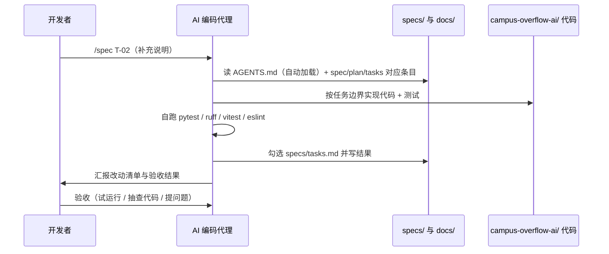
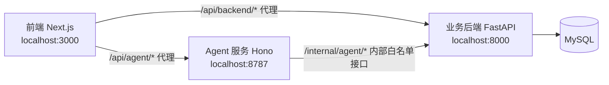

# 操作文档（Agent 协作实操手册）

> 状态：v1（2026-09-06）
> 适用读者：使用 AI 编码代理（Trae / Claude Code / Codex 等）参与本项目开发的成员
> 上游文档：[workflow.md](./workflow.md)（流程定义）、[../AGENTS.md](../AGENTS.md)（代理工作指引）
> 术语与项目保持一致：业务后端、Agent 服务、Agent Loop、内部白名单接口、审批工单、持久化记忆

## 1. 这份文档解决什么问题

把"怎么指挥 AI 编码代理干活"变成可照抄的操作步骤。看完可以独立完成一条完整链路：

```text
环境启动 → 发起任务（/spec）→ 盯执行 → 验收 → 勾选归档 → Git 提交
```

分工原则一句话：**你负责"要什么"和"验什么"，Agent 负责"怎么做"**。判断标准全部来自 `specs/` 和 `AGENTS.md`，不需要口头约定。

## 2. 协作总览

一次任务里，人和 Agent 的交互只有三步：



服务间的开发态架构（谁调谁、走哪个端口）：



## 3. 环境准备（首次，约一次）

### 3.1 前置软件

| 软件 | 版本要求 | 用于 | 检查命令 |
| ---- | -------- | ---- | -------- |
| Node.js | ≥ 22 | 前端、Agent 服务 | `node -v` |
| Python | ≥ 3.11 | 业务后端 | `python --version` |
| uv | 最新即可 | 后端依赖管理 | `uv --version` |
| MySQL | 8.x | 唯一持久层 | `mysql --version` |
| Git | 任意近期版本 | 版本管理 | `git --version` |

### 3.2 安装依赖（三个服务各一次）

```bash
# 业务后端（必须用 uv，不直接用 pip）
cd campus-overflow-ai/backend
uv venv
uv pip install -e ".[dev]"

# 前端
cd campus-overflow-ai/frontend
npm install

# Agent 服务
cd campus-overflow-ai/agent
npm install
```

### 3.3 数据库与配置

1. MySQL 中建库：`campus_overflow`（utf8mb4）。
2. 后端配置读 `campus-overflow-ai/backend/.env`（键名带 `BACKEND_` 前缀）：

```bash
# campus-overflow-ai/backend/.env（本地开发默认值已内置，仅需覆盖不一致项）
BACKEND_DATABASE_URL=mysql+pymysql://用户名:密码@localhost:3306/campus_overflow?charset=utf8mb4
BACKEND_AGENT_SERVICE_TOKEN=dev-agent-token   # 服务间凭证，T-12 启用
```

> 注意：`.env` 不提交 Git；密钥、密码只写在本机 `.env`。

## 4. 日常启动与验证

### 4.1 启动三个服务（三个终端）

```bash
# 终端 1：业务后端（端口 8000）
cd campus-overflow-ai/backend
uv run uvicorn app.main:app --reload

# 终端 2：Agent 服务（端口 8787）
cd campus-overflow-ai/agent
npm run dev

# 终端 3：前端（端口 3000）
cd campus-overflow-ai/frontend
npm run dev
```

### 4.2 健康检查

| 检查点 | 地址 | 预期 |
| ------ | ---- | ---- |
| 业务后端 | http://localhost:8000/health | up |
| Agent 服务 | http://localhost:8787/agent/health | up |
| 前端聚合 | http://localhost:3000/api/health | frontend/backend/agent 全 up |

前端聚合接口挂了后端时不会崩，会标注对应服务 down（对应 X-02 场景）。

## 5. 规格驱动七步：每步你做什么

七步命令与产出定义见 [workflow.md](./workflow.md)，这里只列**你的操作动作**：

| 步骤 | 你输入 | Agent 产出 | 你验收什么 |
| ---- | ------ | ---------- | ---------- |
| 1 constitution | 项目底线规则 | specs/constitution.md | 每条规则可检查（有命令/有数值），不是口号 |
| 2 specify | 要做什么（业务语言） | specs/spec.md | 只写 WHAT，无技术细节 |
| 3 clarify | 回答关键歧义 | 补全后的 spec.md | 边界、默认值、冲突优先级全部关闭 |
| 4 plan | 技术偏好与约束 | specs/plan.md | 方案覆盖全部核心需求 |
| 5 tasks | 拆解要求 | specs/tasks.md | 每任务有目标 + 完成判定 |
| 6 analyze | 触发一致性检查 | specs/analyze.md | 无重大冲突才允许进入 implement |
| 7 implement | 任务号（见第 6 节） | 可运行代码 | 测试过、lint 零 error、主流程可演示 |

**门禁规则（必须记住的两条）**：

- 修改了 spec.md / plan.md / tasks.md 任何一处 → 进入 implement 前必须重跑 `/speckit.analyze`。
- tasks.md 严格按 Phase 顺序执行，不得跳序；失败回改上游文档，不硬闯。

## 6. `/spec <任务号>` 快捷命令（日常主路径）

### 6.1 语法

```text
/spec <任务号>（补充说明，可省略）
```

### 6.2 Agent 收到后自动执行的四条默认约定

| 约定 | 内容 |
| ---- | ---- |
| 默认上下文 | AGENTS.md 硬性约束 1~8 + specs/ 全套；docs/ 按需查阅，不全量读 |
| 执行目标 | 以 specs/tasks.md 该任务的目标与完成判定为准；补充说明只能细化，不得违反宪法 |
| 执行边界 | 只改该任务涉及的模块目录及对应测试；越界先说明理由征得同意 |
| 收尾动作 | 勾选 specs/tasks.md 并写一行结果；若回改了 spec/plan/tasks，重跑 /speckit.analyze |

### 6.3 示例

```text
# 例 1：最常用——只给任务号
/spec T-03

# 例 2：带补充说明，缩小本次范围
/spec T-08（先只做问题/回答投票，周月榜留到下次）

# 例 3：继续上次没做完的任务
/spec T-04（继续，上次的 XSS 清洗测试还没过）
```

### 6.4 什么时候退回完整写法

默认约定覆盖不了时（比如要跨服务改、要动目录结构、有特殊验收要求），改用完整写法，把四要素写全：

```text
/speckit.implement T-12（内部白名单接口与服务间鉴权）
上下文：specs/plan.md 第 5 节接口草案、docs/项目骨架分析.md 第 9 节路径规划
约束：遵守硬性约束 1/5；同时改 backend/app/modules/agent_gateway 与 agent/src/
验收：未带凭证调用被拒；trace id 全链路透传；pytest + vitest 通过
收尾：勾选 T-12；改动涉及服务间协议，回填 specs/analyze.md
```

## 7. 完整操作演示：以 T-02 为例

下面是一次标准任务的完整时间线，照抄即可。

**第 1 步：发起**

```text
/spec T-02（用户注册登录与角色权限，US-02、E-07/E-08）
```

**第 2 步：Agent 执行期间你只需要盯三件事**

- 改动是否越界（T-02 只应动 `backend/app/modules/{users,auth}` + tests）；
- 是否遵守硬性约束（如密码 bcrypt 加密、不出现明文密钥）；
- 中途要打断：直接说话即可；恢复时用 `/spec T-02（继续）`。

**第 3 步：验收清单（照着勾）**

```text
- [ ] uv run pytest 全绿，且覆盖认证与权限边界（越权返回 403）
- [ ] uv run ruff check . 零 error
- [ ] 手工冒烟：注册 → 登录 → 访问受保护接口 → 退出
- [ ] specs/tasks.md 的 T-02 已勾选并写了一行结果
```

**第 4 步：Git 归档（见第 9 节）**

## 8. 异常与恢复操作

| 症状 | 处理操作 |
| ---- | -------- |
| Agent 实现失败/测试不过 | 让 Agent 修复重试；两轮仍失败 → 判断是任务拆得不对 → 回改 tasks.md → 重跑 analyze |
| 发现需求本身要改 | 改 specs/spec.md → 重跑 /speckit.analyze → 再继续 implement |
| 发现方案不可行 | 改 specs/plan.md → 重跑 /speckit.analyze |
| 中途要暂停 | 直接打断对话；下次 `/spec <任务号>（继续）` 或 `/speckit.implement --continue` |
| Agent 改了任务范围外的代码 | 要求回滚该部分（禁止你自己手动大改，避免和规格脱节）；必要时把边界写进任务补充说明 |
| lint/测试在本机不过 | 优先让 Agent 修；属于环境问题（依赖、端口、数据库连接）按第 3 节重查 |
| 任务做完但 tasks.md 没勾 | 明确要求 Agent 补勾——收尾动作是默认约定，遗漏即视为任务未完成 |

## 9. Git 协作操作

### 9.1 分支与提交

```bash
# 分支命名：feat/<短描述>、fix/<短描述>、docs/<短描述>、chore/<短描述>
git checkout -b feat/user-auth

# 提交信息：<type>: <简短中文描述>，type 限定 feat/fix/docs/refactor/test/chore
git add campus-overflow-ai/backend/app/modules/users campus-overflow-ai/backend/app/modules/auth backend/tests specs/tasks.md
git commit -m "feat: 用户注册登录与角色权限（T-02）"
```

### 9.2 提交前自检清单

- [ ] 本次改动所属服务的 lint 与测试已通过（后端 ruff+pytest / 前端、Agent eslint+vitest）
- [ ] 跨服务改动已在提交说明里注明尚未验证的服务
- [ ] 没有提交 `.env`、密钥、日志、构建产物、数据库 dump
- [ ] `specs/tasks.md` 勾选状态与代码实际进度一致

## 10. 命令速查表

| 场景 | 命令 |
| ---- | ---- |
| 发起日常任务 | `/spec <任务号>（补充说明）` |
| 继续中断任务 | `/spec <任务号>（继续）` |
| 改完规格文档后 | `/speckit.analyze` |
| 复杂/跨服务任务 | 完整写法（见 6.4） |
| 后端测试 / Lint | `uv run pytest` / `uv run ruff check .` |
| 前端、Agent 测试 / Lint | `npm test` / `npm run lint` |
| 起后端 | `uv run uvicorn app.main:app --reload` |
| 起前端 / Agent | `npm run dev`（分别在各自目录） |
| 健康总检 | 访问 `http://localhost:3000/api/health` |

## 11. 常见问题

**Q：`/spec` 和 `/speckit.implement` 到底什么关系？**
A：`/spec` 是后者的固定快捷方式，四条默认约定见 [workflow.md](./workflow.md) "快捷命令 /spec" 一节。能覆盖需求就用 `/spec`，覆盖不了就写全四要素。

**Q：可以直接让 Agent 跳过 tasks.md 自己找活干吗？**
A：不可以。任务必须来自 specs/tasks.md；新需求先走 specify→plan→tasks→analyze 补进清单，再实现。

**Q：Agent 说"已完成"但我没看到勾选怎么办？**
A：以 specs/tasks.md 的勾选状态为准，未勾即未完成，要求补勾并写结果。

**Q：数据库表结构要改怎么办？**
A：只能走 Alembic migration，禁止手改表。让 Agent 在任务里完成迁移文件并 `uv run alembic upgrade head` 验证。
