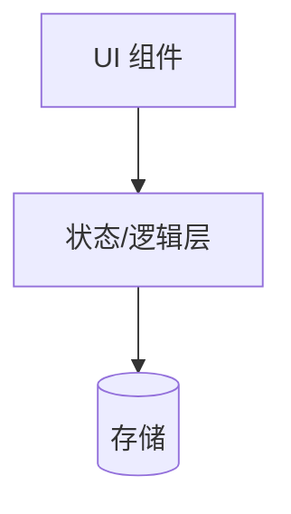

# 技术方案（Plan）

> 状态：模板（待填充）
> 命令：`/speckit.plan`
> 铁律：方案必须能完整覆盖 spec.md 的核心需求，逐条映射。
> 本文件是 spec 的 HOW 层：技术选型、数据模型、接口草案、目录设计。

## 1. 需求覆盖映射

| spec 需求 | 本方案覆盖模块 | 状态 |
| --------- | -------------- | ---- |
| US-01 | （待填写） | 未覆盖/已覆盖 |

## 2. 技术选型

| 层次 | 选型 | 理由 | 约束符合性（对照宪法） |
| ---- | ---- | ---- | ---------------------- |
| 语言/框架 | （待填写） | | |
| 状态管理 | （待填写） | | |
| 数据存储 | （待填写） | | |
| 构建/工具链 | （待填写） | | |

## 3. 架构设计

（待填写：架构图可用 Mermaid，说明模块划分与数据流向）



## 4. 数据模型

（待填写：核心实体定义草案）

```typescript
// 示例：Question 实体设计（完整字段见 docs/设计文档.md 第 6 节）
interface Question {
  id: string;
  courseId: string;
  authorId: string;
  title: string;
  body: string; // Markdown，渲染前需 XSS 清洗
  status: "open" | "resolved" | "closed" | "hidden" | "deleted";
  acceptedAnswerId: string | null;
  createdAt: Date;
}
```

## 5. 接口/内部 API 草案

| 名称 | 签名 | 说明 | 对应 spec |
| ---- | ---- | ---- | --------- |
| （示例）addTask | (title, desc) => Task | 新增任务 | US-01 |

## 6. 存储策略

- （待填写：读写时机、版本号/迁移策略、损坏数据处理）

## 7. 目录结构设计

```text
src/
├── components/   # UI 组件
├── hooks/        # 逻辑复用
├── utils/        # 工具
└── types/        # 类型定义
```

## 8. 风险与技术难点

| 编号 | 描述 | 应对 |
| ---- | ---- | ---- |
| T-01 | （待填写） | |
