# CampusOverflow AI 全量业务拆解与增量开发蓝图

> 状态：草案 v1  
> 用途：在进入模块开发前，先从产品视角建立全局业务蓝图、三端边界、AI 治理引擎、对象关系、状态流转和接口分组。  
> 开发模型：先全量分析，再增量实现。增量开发不是边想边做，而是在全局蓝图稳定后按阶段交付可验证闭环。

## 1. 产品定位

CampusOverflow AI 是面向高校课程场景的 AI 原生问答治理平台。

学生围绕课程产生问题、回答、评论、投票和采纳等内容；教师围绕课程运营知识资产、观察学习热点并参与课程治理；管理员维护平台秩序、配置 AI 治理策略并审计运行链路；AI Agent 负责自发巡检、风险分流、自动处置或转人工待审，并对所有动作留痕。

一句话表达：

> 一个课程问答平台，三种角色端，一套 AI 自发治理与调度引擎。

## 2. 产品总分层

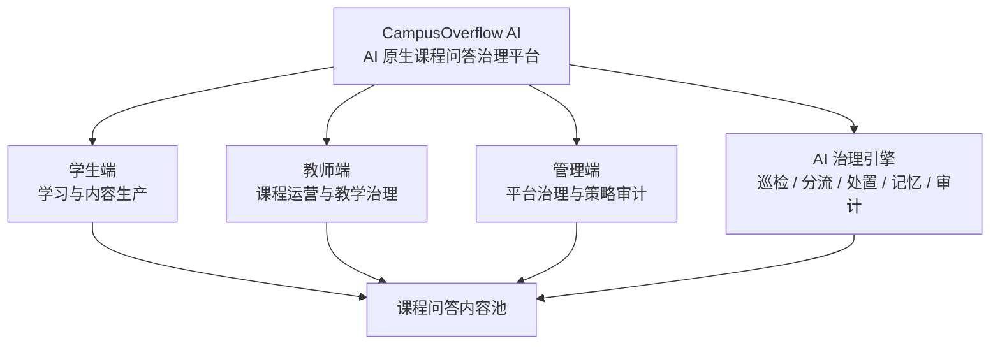

产品上不要把 AI 理解成一个单独页面。AI 是横向引擎，贯穿学生端、教师端和管理端。

## 3. 三端产品拆解

### 3.1 学生端

目标：让学生更快找到答案、提出高质量问题，并参与课程知识沉淀。

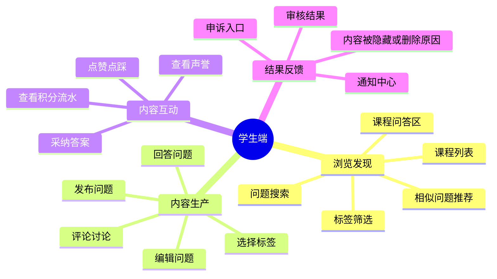

学生端的核心链路：

```text
进入课程 -> 搜索问题 -> 没找到合适答案 -> 发起提问 -> AI 提示相似问题和标签 -> 发布内容 -> 等待回答/审核结果 -> 采纳或继续讨论
```

### 3.2 教师端

目标：让教师把问答内容转化为课程知识资产，并参与课程范围内的治理。

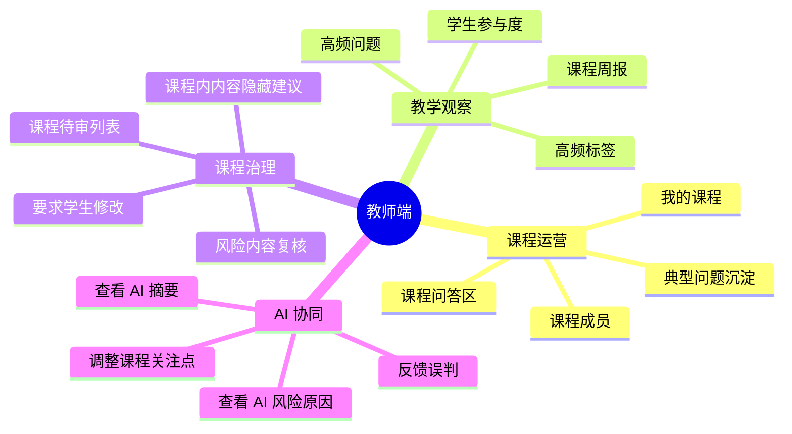

教师端的核心链路：

```text
进入我的课程 -> 查看课程热点 -> 查看 AI 汇总和风险内容 -> 复核课程内待审项 -> 沉淀典型问题 -> 反哺课程教学
```

### 3.3 管理端

目标：让管理员控制全站秩序、AI 策略、用户处罚和可追溯审计。

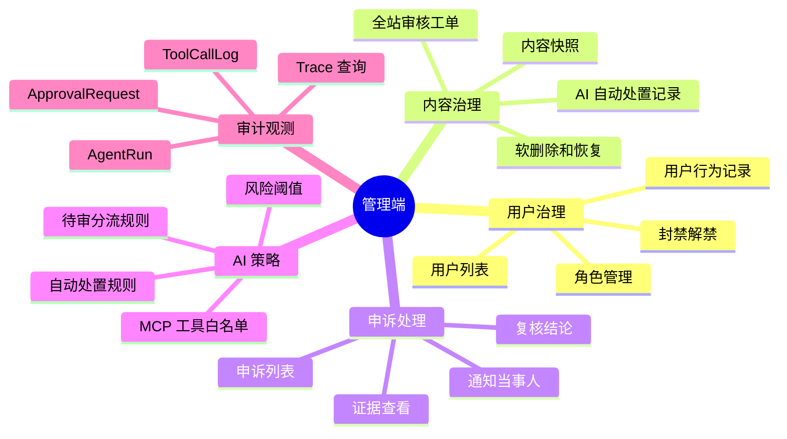

管理端的核心链路：

```text
查看全站风险概览 -> 进入审核工单 -> 查看 AI 判断、内容快照和历史记录 -> 处理或驳回 -> 处理申诉 -> 调整 AI 策略
```

## 4. AI 治理引擎拆解

AI 不是普通聊天助手，而是平台治理调度者。

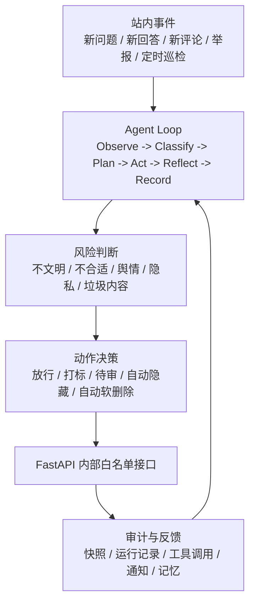

AI 治理动作分级：

| 动作 | AI 是否可自动执行 | 人工关系 | 申诉关系 |
| ---- | ---------------- | -------- | -------- |
| 放行 | 可以 | 无需人工 | 不需要 |
| 风险打标 | 可以 | 后台可查看 | 通常不需要 |
| 放入待审 | 可以 | 教师或管理员复核 | 可通知用户 |
| 临时隐藏 | 可以，但需高置信度和规则约束 | 后审或抽检 | 可申诉 |
| 自动软删除 | 仅限高确定性违规 | 后审必留痕 | 可申诉 |
| 永久删除 | 不允许 | 必须人工 | 可申诉 |
| 限时封禁 | 原则上建议人工确认 | 管理员执行 | 可申诉 |
| 永久封禁 | 不允许自动执行 | 必须管理员确认 | 可申诉 |
| MCP 外部工具调用 | 按风险分级 | 中高风险需审批 | 视动作而定 |

## 5. 前端 / 后端 / AI 端分层

### 5.1 总体技术分层

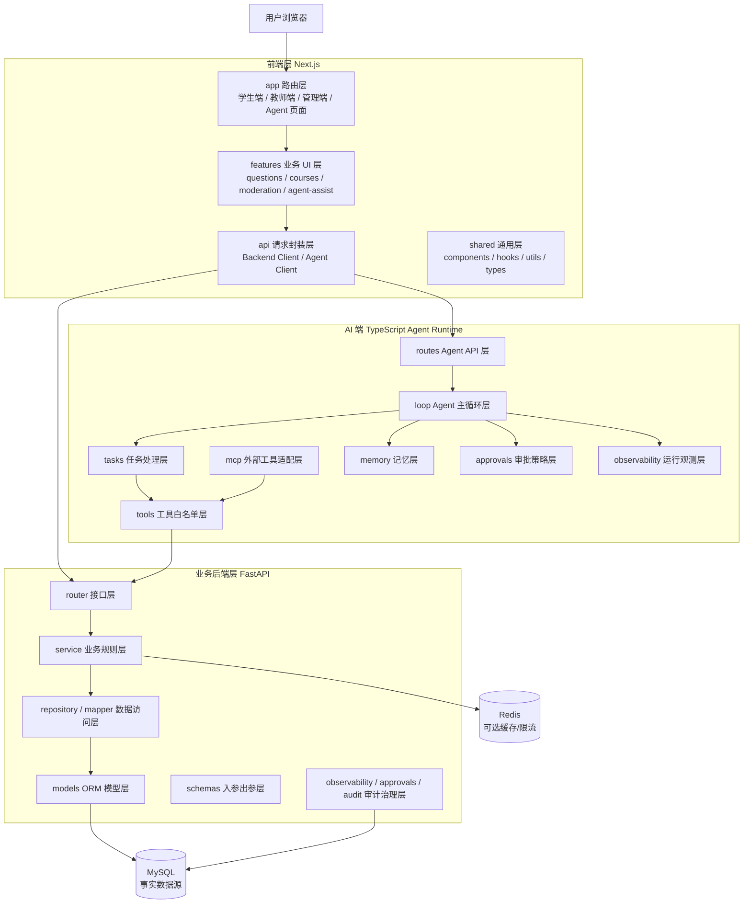

### 5.2 前端分层

```text
frontend/src/
├── app/          路由层：页面、layout、Route Handler、三端入口
├── features/     业务 UI 层：按产品域组织组件和交互
├── api/          接口层：封装 FastAPI 与 Agent 调用
├── shared/       通用层：公共组件、hooks、utils、types
└── styles/       样式层：全局样式和 Tailwind 配置入口
```

前端不负责真正的业务 CRUD，也不负责最终权限判断。它负责把用户操作表达成 API 请求，并把后端、AI 端返回的业务状态清楚展示出来。

### 5.3 后端分层

```text
backend/app/
├── main.py       应用入口与路由注册
├── core/         配置、安全、权限、错误、日志
├── db/           数据库连接、Base、迁移入口
├── modules/      业务模块
└── shared/       通用响应、分页、事件、公共 schema
```

每个业务模块建议使用统一结构：

```text
modules/<domain>/
├── router.py       接口层：接收请求、调用 service、返回响应
├── service.py      业务层：权限、状态流转、事务、业务规则
├── repository.py   mapper 层：封装查询和写入
├── models.py       ORM 模型层：数据库实体
├── schemas.py      入参出参层：Pydantic schema
└── events.py       事件层：通知、审计、AI 巡检触发
```

后端是业务权威层。所有核心 CRUD、权限判断、状态流转、审计落库都应在 FastAPI 内完成。

### 5.4 AI 端分层

```text
agent/src/
├── server.ts        服务启动入口
├── routes/          Agent API 层
├── loop/            Agent Loop 主循环
├── tasks/           任务处理器
├── tools/           工具白名单和工具实现
├── mcp/             MCP 外部工具适配
├── memory/          持久化记忆读写
├── approvals/       高风险动作审批策略
├── observability/   AgentRun、ToolCallLog、trace、日志
├── prompts/         提示词模板
└── types/           类型与 Zod schema
```

AI 端不直接连接 MySQL。AI 端的 CRUD 本质上是工具调用，必须通过 FastAPI 的 `/internal/agent/*` 白名单接口完成。

## 6. 全局业务对象

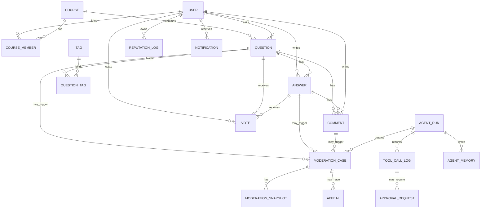

对象分组：

| 分组 | 对象 |
| ---- | ---- |
| 身份与权限 | User、Role、UserBan、CourseMember |
| 课程与内容 | Course、Question、Answer、Comment、Tag、QuestionTag |
| 互动沉淀 | Vote、ReputationLog、Notification |
| 内容治理 | ModerationCase、ModerationSnapshot、Appeal |
| AI 治理 | AgentRun、ToolCallLog、AgentMemory、ApprovalRequest、AgentPolicy、McpServerConfig |

## 7. 核心状态流转

### 7.1 内容状态流转

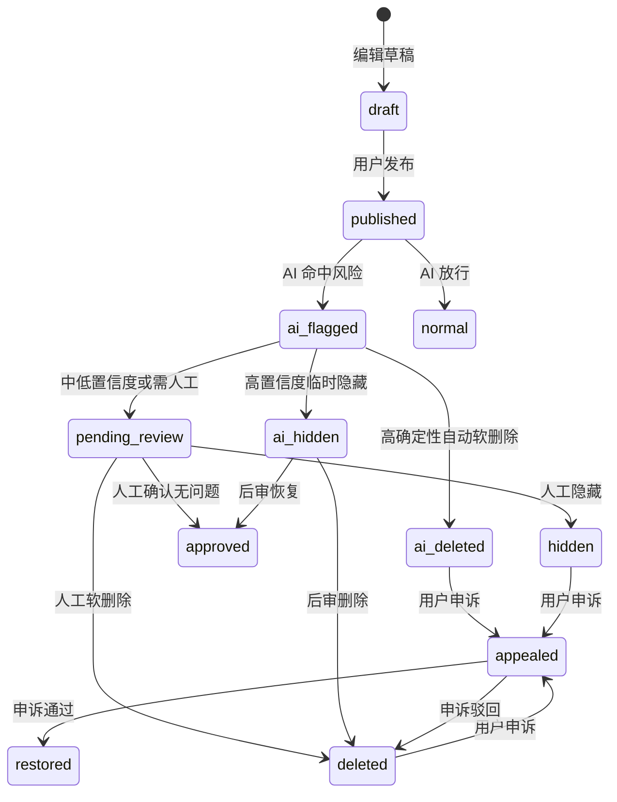

### 7.2 审核工单状态流转

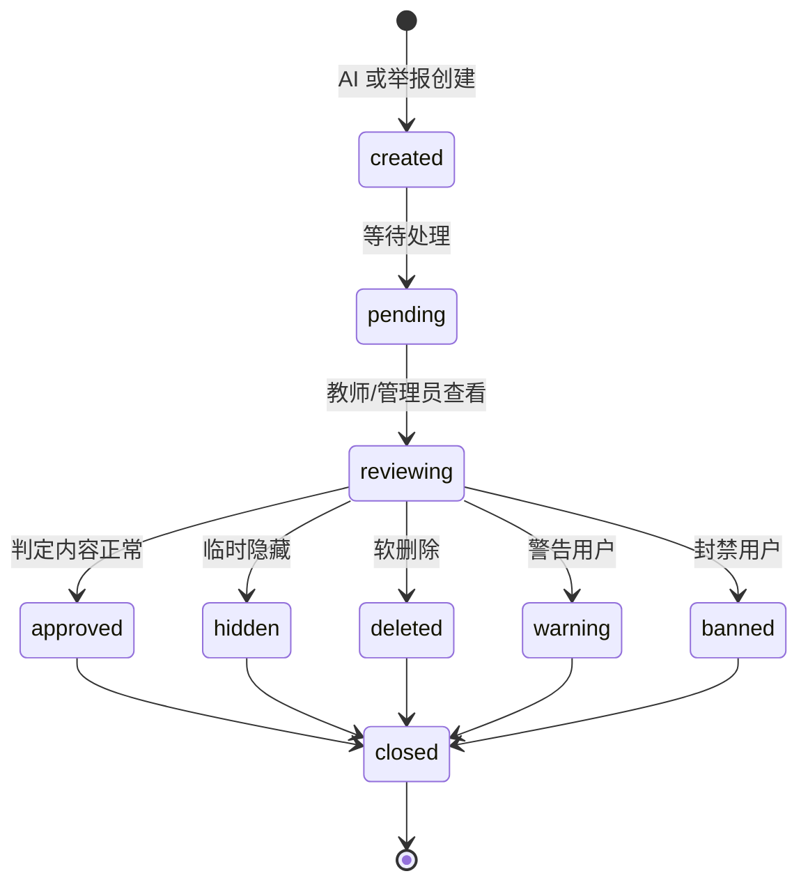

### 7.3 申诉状态流转

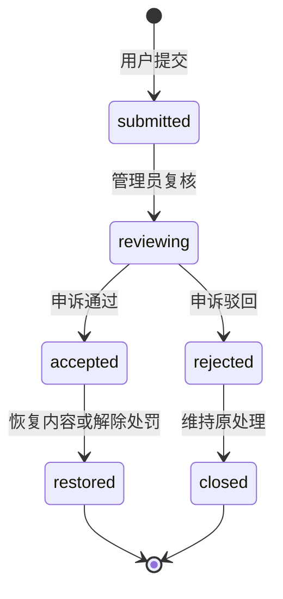

### 7.4 Agent 运行状态流转

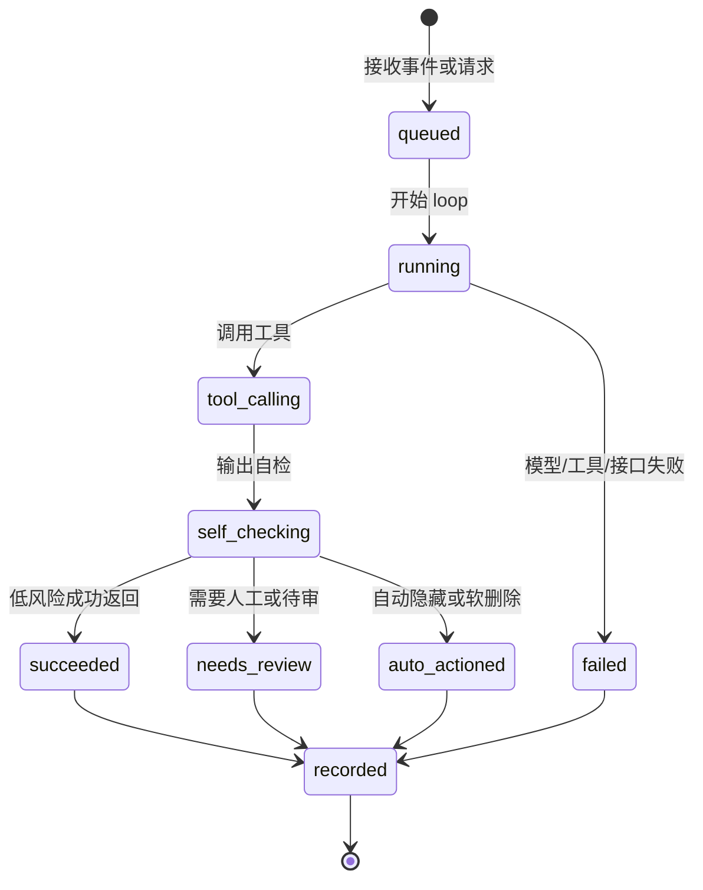

### 7.5 通知状态流转

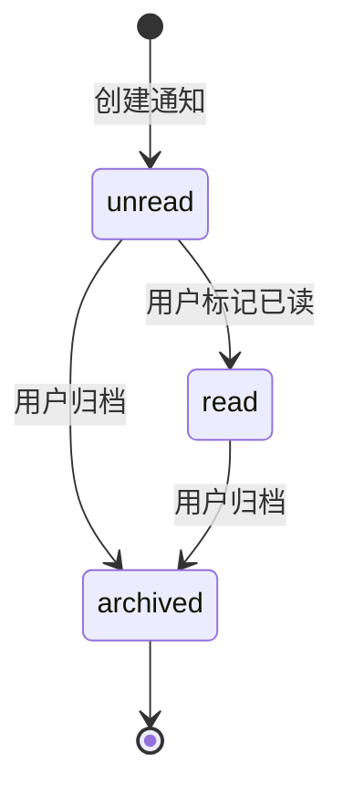

## 8. 关键业务闭环

### 8.1 学生提问与 AI 治理闭环

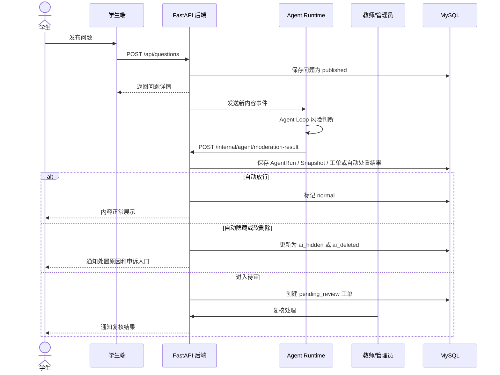

### 8.2 AI 策略调整闭环

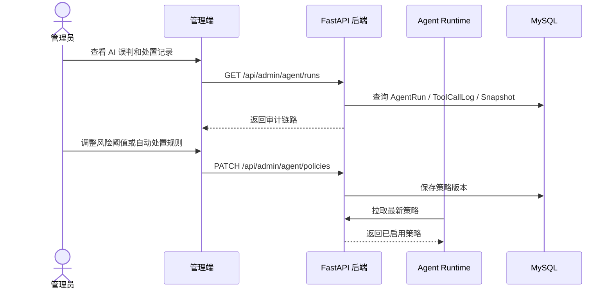

## 9. 接口分组设计

接口文档应按产品模块分组，而不是按文件夹或开发人员分组。

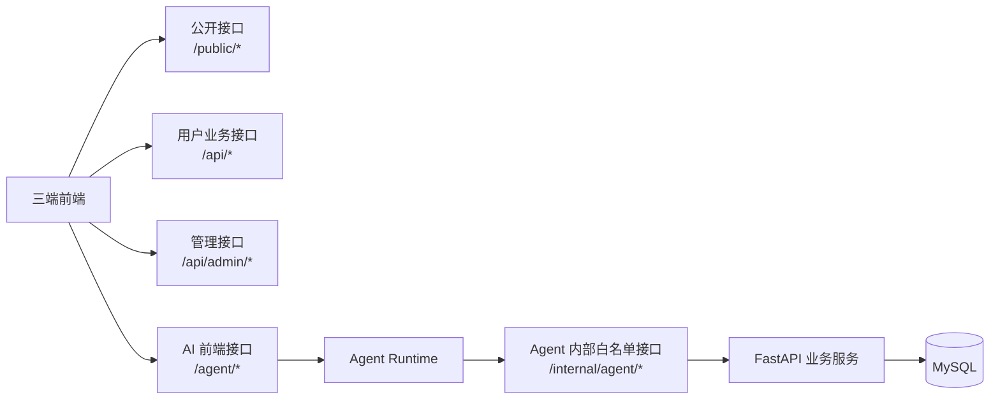

建议接口分组：

| 分组 | 路径前缀 | 面向对象 | 说明 |
| ---- | -------- | -------- | ---- |
| 公开浏览 | `/public/*` 或公开 `GET /api/*` | 游客、学生 | 课程、公开问题、搜索 |
| 认证用户 | `/api/auth/*`、`/api/users/*` | 全部登录用户 | 登录、注册、个人资料 |
| 课程业务 | `/api/courses/*` | 学生、教师 | 课程列表、加入课程、课程详情 |
| 问答业务 | `/api/questions/*`、`/api/answers/*`、`/api/comments/*` | 学生、教师 | 提问、回答、评论、编辑、软删除 |
| 互动沉淀 | `/api/votes/*`、`/api/reputation/*`、`/api/notifications/*` | 登录用户 | 投票、声誉、通知 |
| 教师运营 | `/api/teacher/*` | 教师、助教 | 课程热点、典型问题、课程待审 |
| 管理治理 | `/api/admin/*` | 管理员 | 用户、内容、申诉、策略、审计 |
| AI 前端能力 | `/agent/*` | 前端页面 | 相似问题、标签推荐、运行状态、流式输出 |
| AI 内部能力 | `/internal/agent/*` | Agent Runtime | 内容检索、治理结果写入、记忆、审计、策略读取 |

## 10. 全量业务拆解到增量开发

增量模型的核心是：全量分析，分批交付。每个增量都应该有可演示闭环。

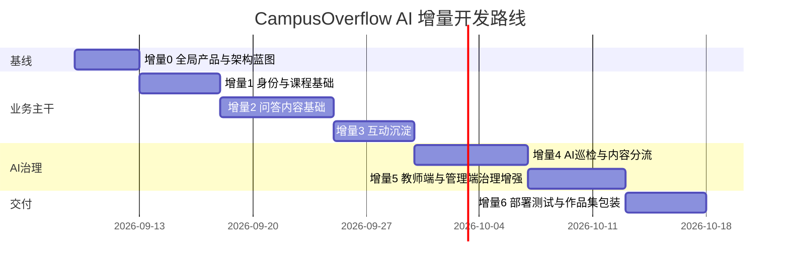

### 增量 0：全局产品与架构蓝图

交付物：

- 三端产品功能树。
- AI 治理引擎职责与权限边界。
- 全局业务对象清单。
- 核心状态流转图。
- 接口分组与命名规则。
- 第一版需求文档、设计文档、接口文档目录。

验收口径：

- 团队成员能说清学生端、教师端、管理端分别解决什么问题。
- 团队成员能说清 AI 能自动做什么，什么必须转人工。
- 每个后续模块都能映射到明确业务对象和状态变化。

### 增量 1：身份与课程基础

交付物：

- 注册、登录、当前用户、角色权限。
- 课程列表、课程详情、加入课程。
- 教师课程管理的最小能力。

验收口径：

- 学生、教师、管理员能进入不同视图。
- 后端能按角色拒绝越权操作。

### 增量 2：问答内容基础

交付物：

- 问题发布、问题列表、问题详情。
- 回答、评论、标签。
- 内容基础状态：published、hidden、deleted。

验收口径：

- 学生能在课程下完成提问、回答、评论。
- 内容能软删除并在普通列表隐藏。

### 增量 3：互动沉淀

交付物：

- 投票、采纳、声誉流水。
- 通知中心。
- 搜索和筛选。

验收口径：

- 一条问题能完成提问、回答、投票、采纳、通知、声誉变化。

### 增量 4：AI 巡检与内容分流

交付物：

- Agent Loop 最小实现。
- 新内容事件接入。
- 风险分级。
- 自动放行、自动隐藏、自动软删除、待审分流。
- AgentRun、ToolCallLog、ModerationSnapshot。

验收口径：

- 学生发布风险内容后，AI 能自发处理并留下可追溯记录。
- 教师或管理员能看到待审队列和 AI 判断原因。

### 增量 5：教师端与管理端治理增强

交付物：

- 教师课程热点。
- 课程周报。
- 管理端 AI 策略配置。
- 申诉处理。
- 审计查询。

验收口径：

- 管理员能根据误判调整策略。
- 用户能对 AI 自动处置结果发起申诉。

### 增量 6：部署测试与作品集包装

交付物：

- Docker Compose。
- Nginx 反向代理。
- 测试报告。
- 演示数据。
- README 和答辩说明。

验收口径：

- 一键启动可演示。
- 能完整演示“学生发内容 -> AI 治理 -> 后台复核 -> 通知/申诉 -> 审计追踪”主链路。

## 11. 写接口文档前的检查清单

在正式写接口文档前，先确认以下问题：

- 每个接口是否对应一个明确用户行为或系统事件。
- 每个写接口是否会改变某个业务对象状态。
- 每个状态变化是否有权限判断。
- AI 自动动作是否有策略来源、置信度、快照和 trace。
- 自动删除和自动隐藏是否提供申诉入口。
- 教师端和管理端的审核边界是否区分清楚。
- 前端是否只展示和提交意图，不承担最终权限判断。
- Agent 是否只通过 FastAPI 内部白名单接口读写业务数据。
- 审计日志是否能串起用户、内容、AI 运行、工具调用、审批和申诉。

## 12. 当前优先级建议

现在最应该先做增量 0，不急着实现 CRUD。

优先顺序：

1. 定稿三端产品树。
2. 定稿 AI 治理动作分级。
3. 定稿内容、审核工单、申诉、AgentRun 状态流转。
4. 定稿业务对象关系。
5. 基于以上内容写接口文档。
6. 再进入增量 1 的用户、课程和权限实现。

这样后续增量开发才不会变成“接口边写边推翻”。
